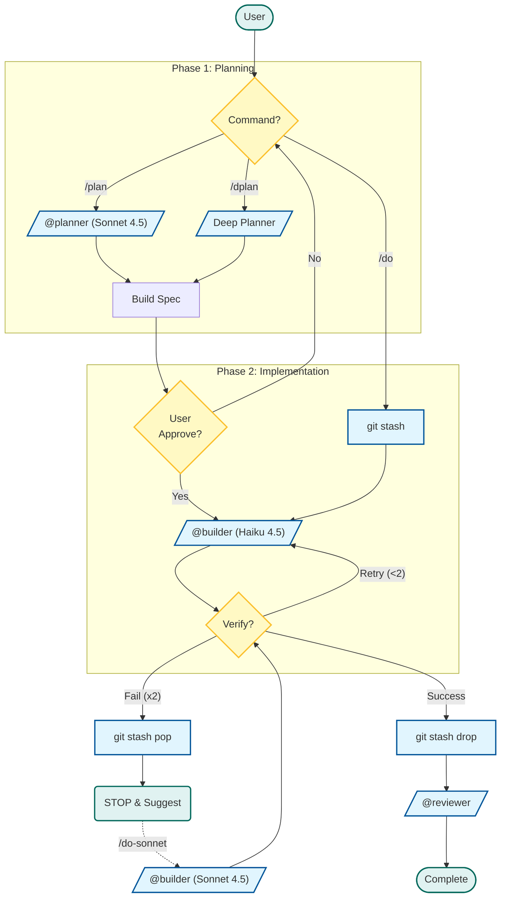

> **[English Version](README.md)**

# Agents Directory

## 목적
모델 최적화와 역할 기반 작업 분담을 위한 서브에이전트 정의를 포함합니다.

## 내용

| 에이전트 | 모델 | 역할 | 도구 | 질문 |
|---------|------|------|------|------|
| `planner.md` | Sonnet 4.5 | 아키텍처 및 설계 결정 | Read, Glob, Grep (읽기 전용) | ≤3 (기본값 포함) |
| `dplanner.md` | Sonnet 4.5 | 연구 기반 심층 계획 | sequential-thinking, perplexity, context7, Read, Glob, Grep | 무제한 |
| `builder.md` | Haiku 4.5 | 구현 (2-retry cap) | Read, Write, Edit, Bash, Glob, Grep | 없음 → 에스컬레이션 |
| `reviewer.md` | Haiku 4.5 | 코드 검토 및 QA | Read, Glob, Grep (읽기 전용, 강제) | 없음 → 에스컬레이션 |

## 각 에이전트 사용 시점

### @planner (빠른 계획)
**사용 시점:**
- 5개 이상의 파일에 영향을 미치는 작업
- 아키텍처 결정이 필요한 경우
- 요구사항이 불명확하여 명확화가 필요한 경우
- 새로운 기능 구현

**실행:** `/plan [작업]`

**출력:** 아키텍처 설계 + 작업 분해 (코드 없음)
**출력 예산:** 작업당 최대 1문장, 파일 경로만 (코드 미리보기 없음)

### @dplanner (심층 계획)
**사용 시점:**
- 깊은 분석이 필요한 복잡한 아키텍처 문제
- 기술 스택 평가
- 경쟁 상태(race condition)나 데드락 디버깅
- 연구가 많이 필요한 결정 (최신 문서/아티클 필요)

**실행:** `/dplan [작업]`

**기능:**
- `sequential-thinking`: 다단계 논리 검증
- `perplexity`: 웹 연구 (블로그, 포럼, 최신 아티클)
- `context7`: 라이브러리 문서 조회

**출력 예산:** 최대 60줄 (코드 블록 제외). 출처 + 출처당 1줄 인사이트만.

### @builder (구현)
**사용 시점:**
- 계획 후 모든 코딩 작업
- 명확히 정의된 간단한 작업 (직접 `/do`)
- 명확한 재현이 가능한 버그 수정

**실행:** `/do [작업]`, `/plan` 위임, `/dplan` 위임

**프로토콜:**
- 최대 2회 재시도 → 실패 시 에스컬레이션
- `~/.claude/scripts/verify.sh` 사용 (런타임 자동 감지)
- 질문 불가 (가정하거나 에스컬레이션)

**출력 예산:** 성공 요약 MAX 5줄 (파일 목록 + 검증 결과만). 에스컬레이션 MAX 8줄. 전체 코드 블록 없이 file:line 참조만.

**롤백 프로토콜:**
- `/do*` 경유 시: `~/.claude/scripts/snapshot.sh push`로 depth guard 포함 라벨 스냅샷 생성
- 성공 시: `~/.claude/scripts/snapshot.sh drop` (라벨 확인, 스냅샷 없으면 안전한 no-op)
- 실패 시: `~/.claude/scripts/snapshot.sh pop` (라벨 확인, 없으면 `git checkout .` 폴백)
- dirty state로 인한 수동 정리 2-4 메시지 낭비 방지

### @reviewer (코드 검토)
**사용 시점:**
- 구현 후 품질 체크
- 보안 감사
- 충돌 감지
- 타입 안전성 검증

**실행:** `/review [대상]`

**카테고리:** SEC (보안), TYPE (타입 안전성), PERF (성능), STYLE (컨벤션), LOGIC (논리 오류), TEST (테스트 누락)

**출력 예산:** PASS = 1줄만. FAIL = MAX 30줄 (심각도 상위 5개 이슈, file:line 참조만).

## 워크플로우 (Detailed Flowchart)




## 설계 결정

| 결정 | 근거 |
|------|------|
| 4개 에이전트 (vs. Affaan 13개) | Pro Plan 제약: 서브에이전트 호출마다 quota 소비. 역할 통합으로 API 오버헤드 감소하면서도 기능 유지 |
| @builder와 @reviewer에 Haiku 4.5 사용 | 비용 최적화: 구현과 검토는 Sonnet 수준의 추론이 불필요. Haiku 4.5는 5배 저렴 ($1 vs $5 /MTok input) |
| @planner와 @dplanner에 Sonnet 4.5 사용 | 아키텍처 결정은 추론 능력 필요. Pro Plan에서 Sonnet 4.5가 Opus 4.6보다 가성비 우수 |
| @builder 2-retry cap | Quota 소진 방지. 2회 실패 → Sonnet 4.5/Opus 4.6으로 에스컬레이션 또는 @planner로 재설계 |
| @reviewer 읽기 전용 강제 | Hook 기반 차단(`readonly-check.sh`). 검토 중 실수로 수정하는 것 방지 |
| @dplanner에 MCP 도구 제공 | 연구가 많은 작업은 MCP 오버헤드 정당화 가능. `sequential-thinking` + `perplexity` + `context7`로 실패 없는 계획 가능 |
| 에이전트별 출력 예산 | Output은 Input의 5배 비용 (API 가격). 엄격한 예산: builder 5줄, reviewer 1줄 PASS / 30줄 FAIL, dplanner 60줄, planner 1문장/작업 |
| @builder 원자적 롤백 | `~/.claude/scripts/snapshot.sh`가 depth guard + 라벨 확인 포함 `git stash` 처리. 무관한 사용자 stash pop 방지. 실패 시 `pop` (또는 clean tree에서 `git checkout .`) → 즉시 에스컬레이션 가능한 깨끗한 상태. 실패당 2-4 메시지 절약, API 비용 0 |

## 커스텀 에이전트 추가

새로운 `.md` 파일을 **frontmatter**와 함께 생성하세요 (필수):

```markdown
---
name: my-agent
description: 이 에이전트를 언제 사용하는지
model: haiku | sonnet | opus
permissionMode: plan | acceptEdits
tools: Read, Write, Edit, Bash, Glob, Grep
disallowedTools: Write, Edit
hooks:
  Stop:
    - hooks:
        - type: command
          command: "~/.claude/scripts/hooks/my-hook.sh"
          timeout: 5
---

# My Agent

## 역할
이 에이전트가 하는 일.

## 규칙
- 규칙 1
- 규칙 2

## 출력 형식
\`\`\`
예상 출력
\`\`\`
```

### Frontmatter 필드

| 필드 | 필수 | 설명 |
|------|:----:|------|
| `name` | 예 | 에이전트 식별자 (소문자, 하이픈) |
| `description` | 예 | 언제 사용하는지 (Task tool 자동 선택용) |
| `model` | 예 | `haiku`, `sonnet`, 또는 `opus` |
| `permissionMode` | 아니오 | `plan` (읽기 전용) 또는 `acceptEdits` (쓰기 권한) |
| `tools` | 아니오 | 허용 도구 (화이트리스트) |
| `disallowedTools` | 아니오 | 차단 도구 (블랙리스트) |
| `hooks` | 아니오 | 라이프사이클 훅 (`PreToolUse`, `PostToolUse`, `Stop`) |

### 위치
- 전역: `~/.claude/agents/` (모든 프로젝트)
- 프로젝트: `./.claude/agents/` (이 프로젝트만)
