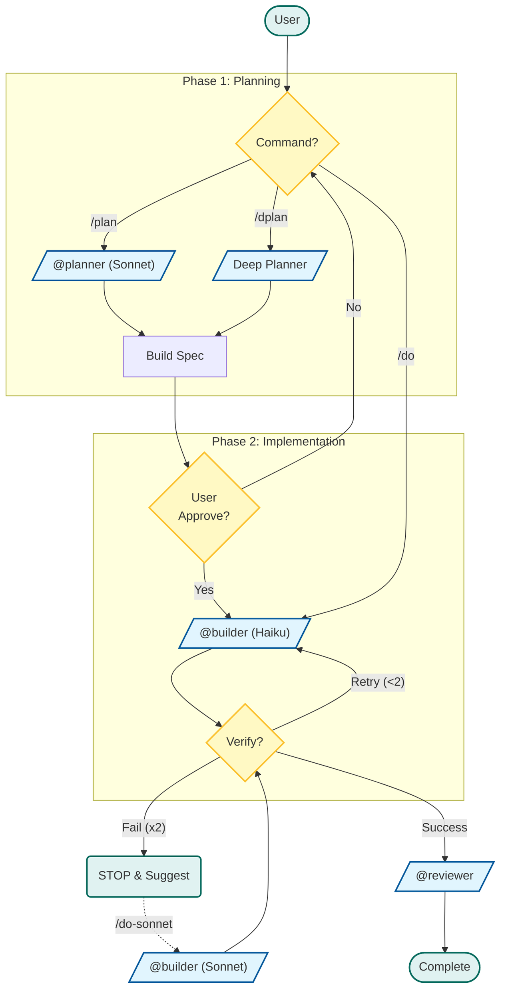

> **[한국어 버전](README.ko.md)**

# Agents Directory

## Purpose
Contains sub-agent definitions for role-based task delegation with model optimization.

## Contents

| Agent | Model | Role | Tools | Questions |
|-------|-------|------|-------|-----------|
| `planner.md` | Sonnet | Architecture & design decisions | Read, Glob, Grep (read-only) | ≤3 (with defaults) |
| `dplanner.md` | Sonnet | Deep planning with research | sequential-thinking, perplexity, context7, Read, Glob, Grep | Unlimited |
| `builder.md` | Haiku | Implementation (2-retry cap) | Read, Write, Edit, Bash, Glob, Grep | None → Escalate |
| `reviewer.md` | Haiku | Code review & QA | Read, Glob, Grep (read-only, enforced) | None → Escalate |

## When to Use Each Agent

### @planner (Quick Planning)
**Use for:**
- Tasks affecting 5+ files
- Architectural decisions needed
- Unclear requirements requiring clarification
- New feature implementation

**Triggers:** `/plan [task]`

**Output:** Architecture design + task breakdown (no code)

### @dplanner (Deep Planning)
**Use for:**
- Complex architectural problems requiring deep analysis
- Technology stack evaluation
- Debugging race conditions or deadlocks
- Research-heavy decisions (needs latest docs/articles)

**Triggers:** `/dplan [task]`

**Capabilities:**
- `sequential-thinking`: Multi-step logic verification
- `perplexity`: Web research (blogs, forums, latest articles)
- `context7`: Library documentation lookup

### @builder (Implementation)
**Use for:**
- All coding tasks after planning
- Simple well-defined tasks (direct `/do`)
- Bug fixes with clear reproduction

**Triggers:** `/do [task]`, `/plan` delegation, `/dplan` delegation

**Protocol:**
- Maximum 2 retries → Escalate on failure
- Uses `scripts/verify.sh` (runtime-adaptive)
- No questions allowed (assumes or escalates)

### @reviewer (Code Review)
**Use for:**
- Post-implementation quality check
- Security audit
- Conflict detection
- Type safety verification

**Triggers:** `/review [target]`

**Categories:** SEC (Security), TYPE (Type safety), PERF (Performance), STYLE (Convention), LOGIC (Logic error), TEST (Missing test)

## Workflow (Detailed Flowchart)




## Design Decisions

| Decision | Rationale |
|----------|-----------|
| 4 agents (vs. Affaan's 13) | Pro Plan constraint: Each sub-agent invocation costs quota. Role consolidation reduces API overhead while maintaining capability |
| Haiku for @builder and @reviewer | Cost optimization: Implementation and review don't need Sonnet-level reasoning. Haiku is 5x cheaper |
| Sonnet for @planner and @dplanner | Architecture decisions need reasoning capability. Sonnet balances cost/performance better than Opus on Pro Plan |
| @builder 2-retry cap | Prevents quota drain. Failed twice → Escalate to Sonnet/Opus or @planner for re-design |
| @reviewer read-only enforcement | Hook-based blocking (`readonly-check.sh`). Prevents accidental modifications during review |
| @dplanner with MCP tools | Research-heavy tasks justify MCP overhead. `sequential-thinking` + `perplexity` + `context7` enable fail-proof planning |

## Adding Custom Agents

Create a new `.md` file with **frontmatter** (required):

```markdown
---
name: my-agent
description: When to use this agent
model: haiku | sonnet | opus
permissionMode: plan | acceptEdits
tools: Read, Write, Edit, Bash, Glob, Grep
disallowedTools: Write, Edit
hooks:
  Stop:
    - hooks:
        - type: command
          command: "~/.claude/scripts/hooks/my-hook.sh"
          timeout: 5
---

# My Agent

## Role
What this agent does.

## Rules
- Rule 1
- Rule 2

## Output Format
\`\`\`
Expected output
\`\`\`
```

### Frontmatter Fields

| Field | Required | Description |
|-------|:--------:|-------------|
| `name` | Yes | Agent identifier (lowercase, hyphens) |
| `description` | Yes | When to use this agent (for Task tool auto-selection) |
| `model` | Yes | `haiku`, `sonnet`, or `opus` |
| `permissionMode` | No | `plan` (read-only) or `acceptEdits` (write access) |
| `tools` | No | Allowed tools (whitelist) |
| `disallowedTools` | No | Blocked tools (blacklist) |
| `hooks` | No | Lifecycle hooks (`PreToolUse`, `PostToolUse`, `Stop`) |

### Location
- Global: `~/.claude/agents/` (all projects)
- Project: `./.claude/agents/` (this project only)
