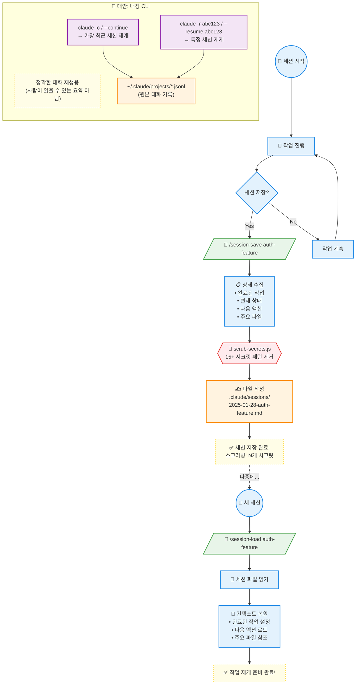

> **[English Version](README.md)**

# Sessions Directory

## 목적
`/session-save`에 의해 생성된 세션 상태 파일을 저장합니다. 세션 간에 연속성을 가능하게 합니다.

## 세션 생명주기



### 커스텀 vs 내장 세션

| 기능 | `/session-save` + `/session-load` | `claude --continue` |
|------|-----------------------------------|---------------------|
| **형식** | 사람이 읽을 수 있는 `.md` | 원본 `.jsonl` |
| **위치** | `.claude/sessions/` (프로젝트) | `~/.claude/projects/` (전역) |
| **내용** | 요약 (작업, 결정, 다음 단계) | 전체 대화 기록 |
| **시크릿 스크러빙** | ✅ 자동 | ❌ 스크러빙 없음 |
| **적합한 용도** | 컨텍스트 공유, 문서화 | 정확한 대화 재생 |

### 언제 무엇을 사용할까?

| 상황 | 추천 | 이유 |
|------|------|------|
| 짧은 휴식 후 재개 (같은 날) | `claude -c` | 빠르고 정확한 대화 이어가기 |
| 긴 휴식 후 재개 (다음 날) | `/session-load` | 핵심 컨텍스트만 로드, 비용 절약 |
| 팀원과 컨텍스트 공유 | `/session-save` | 사람이 읽을 수 있는 `.md` 공유 가능 |
| 시크릿 포함한 작업 후 | `/session-save` | 자동 스크러빙으로 안전 |
| 정확한 대화 기록 필요 | `claude --resume` | 전체 대화 그대로 복원 |

### 추천 워크플로우

```
📅 1일차 오전: 새 작업 시작
📅 1일차 오후: 점심 후 → claude -c (내장 CLI로 빠른 재개)
📅 1일차 저녁: /session-save feature-v1 (작업 요약 저장)

📅 2일차: /session-load feature-v1 (깔끔한 컨텍스트로 시작)
📅 2일차 오후: claude -c (같은 날 빠른 재개)
📅 2일차 저녁: /session-save feature-v2 (진행 상황 저장)
```

> **💡 Tip**: 둘은 **경쟁이 아니라 보완 관계**입니다. 상황에 맞게 골라 쓰세요!

## 파일 명명

```
YYYY-MM-DD-[name].md
```

예시:
- `2025-01-27-auth-jwt.md`
- `2025-01-27-payment-integration.md`

## 보안

**모든 세션 파일은 기록되기 전에 자동으로 스크러빙(민감 정보 제거)됩니다.**

스크러빙되는 패턴:
- API 키 (OpenAI, Anthropic, Stripe, GitHub, AWS)
- 자격 증명이 포함된 데이터베이스 URL
- JWT 토큰
- 비밀번호 필드
- 개인 키 (Private keys)

## 사용법

```bash
# 현재 세션 저장
/session-save auth-feature

# 가장 최근 세션 로드
/session-load

# 특정 세션 로드
/session-load auth-feature

# 사용 가능한 세션 목록
/session-load --list
```

## 세션 파일 형식

```markdown
# Session: [name]
Date: [timestamp]
Duration: [messages]
Security: [items scrubbed]

## Context
- Project: [name]
- Branch: [branch]
- Focus: [description]

## Completed
- [x] [task]

## In Progress
- [ ] [task] - [status]

## Decisions Made
- [decision]: [reasoning]

## Next Steps
1. [action]

## Key Files
- [file]: [why relevant]

## Loaded Contexts
- [type]: [status]

## Learned Patterns
- [pattern]
```

## 유지 관리

```bash
# 세션 목록 조회
ls -la .claude/sessions/

# 오래된 세션 삭제 (>30일)
find .claude/sessions/ -mtime +30 -delete

# 수동 스크러빙 (필요한 경우)
node scripts/scrub-secrets.js < session.md > clean.md
```

## Claude 내장 세션 명령어

커스텀 `/session-save`, `/session-load` 외에도 Claude Code 내장 세션 기능이 있습니다:

| 명령어 | 목적 |
|--------|------|
| `claude -c` / `--continue` | 가장 최근 세션 재개 |
| `claude -r "id"` / `--resume "id"` | 특정 세션 ID로 재개 |
| `claude --resume` | 최근 세션 목록에서 선택 |

> **참고:** 내장 세션은 `~/.claude/projects/.../*.jsonl`에 저장됩니다. 커스텀 `/session-save`는 `.claude/sessions/`에 사람이 읽을 수 있는 `.md` 요약을 생성합니다.

## 모범 사례

1. 논리적 단계가 완료된 후 저장
2. 긴 휴식 전 (>4시간) 저장
3. 설명적인 이름 사용
4. 주기적으로 오래된 세션 정리
5. **스크립트 실행 권한 확인**: `chmod +x scripts/hooks/*.sh`

