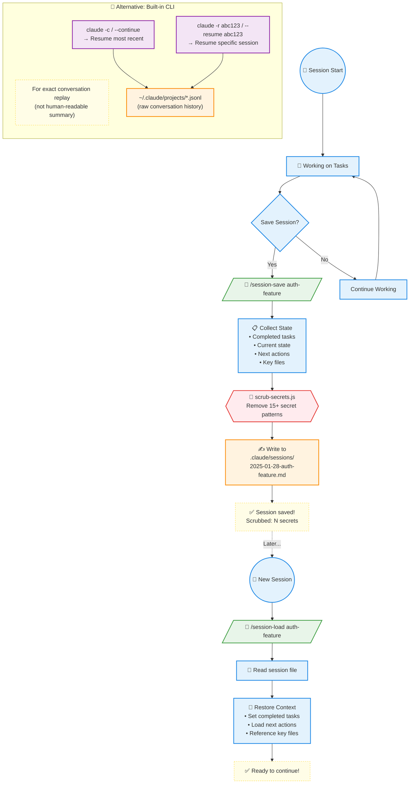

> **[한국어 버전](README.ko.md)**

# Sessions Directory

## Purpose
Stores session state files created by `/session-save`. Enables continuity across sessions.

## Session Lifecycle



### Custom vs Built-in Sessions

| Feature | `/session-save` + `/session-load` | `claude --continue` |
|---------|-----------------------------------|---------------------|
| **Format** | Human-readable `.md` | Raw `.jsonl` |
| **Location** | `.claude/sessions/` (project) | `~/.claude/projects/` (global) |
| **Content** | Summary (tasks, decisions, next steps) | Full conversation transcript |
| **Secret Scrubbing** | ✅ Automatic | ❌ Not scrubbed |
| **Best For** | Sharing context, documentation | Exact conversation replay |

### When to Use What?

| Situation | Recommended | Why |
|-----------|-------------|-----|
| Short break (same day) | `claude -c` | Fast, exact conversation resume |
| Long break (next day) | `/session-load` | Load only key context, reduce cost |
| Share context with team | `/session-save` | Human-readable `.md` for sharing |
| After working with secrets | `/session-save` | Auto-scrubbing for safety |
| Need exact conversation | `claude --resume` | Full transcript replay |

### Recommended Workflow

```
📅 Day 1 Morning: Start new task
📅 Day 1 Afternoon: After lunch → claude -c (quick resume with built-in CLI)
📅 Day 1 Evening: /session-save feature-v1 (save work summary)

📅 Day 2: /session-load feature-v1 (start fresh with clean context)
📅 Day 2 Afternoon: claude -c (quick resume same day)
📅 Day 2 Evening: /session-save feature-v2 (save progress)
```

> **💡 Tip**: These two systems are **complementary, not competing**. Use both based on the situation!

## File Naming

```
YYYY-MM-DD-[name].md
```

Examples:
- `2025-01-27-auth-jwt.md`
- `2025-01-27-payment-integration.md`

## Security

**All session files are automatically scrubbed before writing.**

Scrubbed patterns include:
- API keys (OpenAI, Anthropic, Stripe, GitHub, AWS)
- Database URLs with credentials
- JWT tokens
- Password fields
- Private keys

## Usage

```bash
# Save current session
/session-save auth-feature

# Load most recent
/session-load

# Load specific session
/session-load auth-feature

# List available sessions
/session-load --list
```

## Session File Format

```markdown
# Session: [name]
Date: [timestamp]
Duration: [messages]
Security: [items scrubbed]

## Context
- Project: [name]
- Branch: [branch]
- Focus: [description]

## Completed
- [x] [task]

## In Progress
- [ ] [task] - [status]

## Decisions Made
- [decision]: [reasoning]

## Next Steps
1. [action]

## Key Files
- [file]: [why relevant]

## Loaded Contexts
- [type]: [status]

## Learned Patterns
- [pattern]
```

## Maintenance

```bash
# List sessions
ls -la .claude/sessions/

# Delete old sessions (>30 days)
find .claude/sessions/ -mtime +30 -delete

# Manual scrub (if needed)
node ~/.claude/scripts/scrub-secrets.js < session.md > clean.md
```

## Claude Built-in Session Commands

In addition to custom `/session-save` and `/session-load`, Claude Code has built-in session features:

| Command | Purpose |
|---------|---------|
| `claude -c` / `--continue` | Resume most recent session |
| `claude -r "id"` / `--resume "id"` | Resume specific session by ID |
| `claude --resume` | Show recent sessions to select |

> **Note:** Built-in sessions are stored in `~/.claude/projects/.../*.jsonl`. Custom `/session-save` creates human-readable `.md` summaries in `.claude/sessions/`.

## Best Practices

1. Save after completing logical phases
2. Save before long breaks (>4 hours)
3. Use descriptive names
4. Prune old sessions periodically
5. **Ensure scripts are executable**: `chmod +x ~/.claude/scripts/hooks/*.sh`

