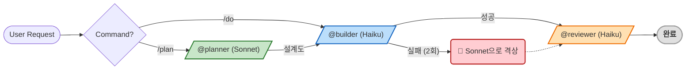

> **[English Version](README.md)**

<!-- Badges -->


# Claude Pro MinMax (CPMM)

> **토큰은 Minimum, 지능은 Maximum. Quota의 한계를 뛰어넘으세요.**

Pro Plan 제약에 최적화된 Claude Code 설정입니다.
---

> [!TIP]
> **🚀 3초 요약: 왜 이걸 써야 하나요?**
> 1.  **Quota 방어:** 무지성 병렬 실행을 막고 **순차 실행**을 강제하여 토큰을 아낍니다.
> 2.  **비용 최적화:** 비싼 Opus 대신 **Haiku(구현) + Sonnet(설계)** 조합을 사용합니다.
> 3.  **무비용 자동화:** API를 쓰지 않는 **11개의 로컬 Hook**으로 안전장치를 제공합니다.

---

## 🛠 설치 (Installation)

### 1. 필수 도구 준비
```bash
npm install -g @anthropic-ai/claude-code
npm install -g @mixedbread/mgrep
mgrep install-claude-code
brew install jq   # macOS (Linux: sudo apt-get install jq)
```

### 2. CPMM 설치

1. **Perplexity API 키 설정 (필수)**:
   `perplexity` 도구를 사용하려면 설치 전에 `.claude.json` 파일을 열고 `"YOUR_API_KEY_HERE"` 부분을 본인의 API 키로 교체하세요.
   **키가 없다면 `perplexity` 섹션 전체를 삭제해야 오류가 발생하지 않습니다.** (예: `.claude.json` 파일 내 `"mcpServers"` > `"perplexity"` 블록 전체 삭제)

2. **설치 스크립트 실행**:
```bash
git clone https://github.com/move-hoon/claude-pro-minmax.git
cd pro-plan-claude-code
# .claude.json 수정 (API 키 입력 또는 섹션 삭제)
vi .claude.json 
bash install.sh
```

> **Note:** 설치 스크립트가 기존 `~/.claude` 설정을 자동으로 백업(`~/.claude-backup-{timestamp}`)합니다.

---

## 문제 정의

Claude Pro Plan에는 Claude Code 사용 방식을 근본적으로 바꾸는 제약이 있습니다:

- **5시간 Rolling 리셋**: 5시간마다 사용량이 리셋되어 짧고 집중된 세션을 권장합니다
- **메시지 기반 Quota (길이 민감)**: 대화가 길어질수록(Context가 쌓일수록) 메시지 하나당 차감되는 할당량이 기하급수적으로 늘어납니다. ([Claude Help Center](https://support.anthropic.com/en/articles/8325606-what-is-claude-pro))
- **주간 제한**: 과다 사용자에게 추가 주간 cap이 적용됩니다

원본 [everything-claude-code](https://github.com/affaan-m/everything-claude-code)는 사실상 무제한에 가까운 **Max Plan** 환경에 최적화된 강력한 도구입니다. 하지만 병렬 에이전트나 다중 인스턴스 같은 '고출력' 패턴을 **Pro Plan**에서 그대로 답습하면, 급격한 컨텍스트 누적으로 인해 Quota가 순식간에 고갈되고 맙니다.

이 프로젝트는 강력한 기능은 유지하면서 Pro Plan 제약에 맞게 아키텍처를 재설계했습니다.

---

## 핵심 전략

### 1. 목표 (Goal)
**Pro Plan의 5시간 Quota 창 내에서 세션 지속 가능성 최대화**

이 설정은 작업당 Quota 소비를 줄여 생산적인 작업 시간을 연장하도록 설계되었습니다. 목표는 "제한 우회"가 아니라, **리소스 효율성 최적화**를 통해 할당량을 소진하지 않고 더 오래 작업하는 것입니다.

### 2. 접근 방식 (Approach)
Anthropic은 정확한 알고리즘을 공개하지 않았지만, Quota 소비는 다음 3가지에 영향을 받습니다. 이 프로젝트는 이를 모두 최적화합니다.

* **컨텍스트 크기 (입력 토큰):** 순차 실행으로 중복 제거
* **응답 길이 (출력 토큰):** CLI 필터링으로 감소
* **모델 유형 (컴퓨팅 비용):** 전략적 모델 선택

### 3. 실행 전략: 원자적 워크플로우 & 순차적 실행

1.  **원자적 작업 실행 (Atomic Execution)**
    * 각 작업이 하나의 완전한 사이클을 완료합니다. (계획 → 빌드 → 리뷰 → 저장)
    * 페이즈당 에이전트 1회 실행 (반복 재호출 없음)
    * 사이클 완료 후 다음 작업으로 깔끔하게 이동합니다.

2.  **작업당 비용 최소화 (Cost Minimization)**
    * `@builder` (Haiku): 구현 담당 (API 가격상 가장 적은 리소스 소비)
    * `@planner` (Sonnet): 아키텍처 설계 (균형 잡힌 능력과 비용)
    * **Opus**: 필요할 때만 에스컬레이션 (API 가격상 가장 비쌈)

3.  **컨텍스트 크기 감소 (Context Reduction)**
    * **순차 실행:** 한 번에 하나의 에이전트만 실행하여 컨텍스트 중복 누적을 막습니다. (3~4개 병렬 실행 금지)
    * **중단 가능:** 작업 사이에 언제든 중단할 수 있습니다.
    * **CLI 필터링:** 도구 출력 토큰을 대폭 감소시킵니다.

4.  **안전한 에스컬레이션 경로 (Safety Ladder)**
    * Haiku 실패 (2회 재시도 후) → Sonnet으로 격상 (`/do-sonnet`)
    * Sonnet 실패 → Opus로 격상 (`/do-opus`)
    * 명시적 모델 선택으로 비용을 인지하게 합니다.

---

## 📊 결과 및 비교

**주요 기대 효과:**
✅ 병렬 실행 대비 훨씬 긴 세션
✅ 예측 가능한 사용 패턴 (작업 계획 용이)
✅ 전략적 에스컬레이션을 통한 높은 성공률

> [!NOTE]
> **참고:** Anthropic의 정확한 Quota 알고리즘은 비공개입니다. 본 설정은 API 가격 및 토큰 패턴을 기반으로 한 최적화이며, 실제 결과는 작업 복잡도에 따라 달라질 수 있습니다.

### Quota 소진 시뮬레이션

```mermaid
gantt
    title ⚡️ Quota 소비: 병렬(폭주) vs 순차(효율)
    dateFormat HH:mm
    axisFormat %H:%M
    todayMarker off

    section 🔴 기존 (병렬 실행)
    Agent 1 (Sonnet)      :crit, a1, 00:00, 45m
    Agent 2 (Haiku)       :crit, a2, 00:00, 45m
    Agent 3 (Reviewer)    :crit, a3, 00:00, 45m
    💥 Quota 고갈 (45분) :milestone, 00:45, 0m

    section 🟢 CPMM (순차 실행)
    Task 1 (Plan+Build)   :active, s1, 00:00, 1h
    Task 2 (Refactor)     :s2, after s1, 1h
    Task 3 (Test+Fix)     :s3, after s2, 1h
    Task 4 (New Feature)  :s4, after s3, 1h
    ✅ 5시간 생존 완료      :milestone, 05:00, 0m
```



---

## 🚀 빠른 시작 (Quick Start)

### 🤖 에이전트 워크플로우

CPMM은 작업의 복잡도에 따라 Sonnet(설계)과 Haiku(구현)를 자동으로 오가며 최적의 효율을 냅니다.



### ⌨️ 명령어 가이드

**1. 핵심 명령어 (Core Commands)**

가장 자주 사용하는 필수 명령어입니다.

| 명령어 | 설명 | 추천 상황 |
| --- | --- | --- |
| `/do [작업]` | **Haiku**로 빠르게 구현 | 간단한 버그 수정, 스크립트 작성 |
| `/plan [작업]` | **Sonnet** 설계 → **Haiku** 구현 | 기능 추가, 리팩토링, 복잡한 로직 |
| `/review [대상]` | **Haiku** (읽기 전용) | 코드 리뷰 (파일 또는 디렉토리 지정 가능) |

<details>
<summary><strong>🚀 심화 명령어 (Advanced Commands) - Click to Expand</strong></summary>

더 정교한 작업이나 세션 관리를 위한 전체 명령어 목록입니다.

| 명령어 | 설명 | 추천 상황 |
| :--- | :--- | :--- |
| **🧠 심층 실행** | | |
| `/dplan [작업]` | **Sonnet** + 검색(Perplexity) | 라이브러리 비교, 최신 기술 조사 (심층 연구) |
| `/do-sonnet` | **Sonnet**으로 직접 실행 | Haiku가 계속 실패할 때 수동 격상 |
| `/do-opus` | **Opus**로 직접 실행 | 매우 복잡한 문제 해결 (비용 주의) |
| **💾 세션/컨텍스트** | | |
| `/session-save` | 세션 요약 및 저장 | 작업 중단 시 (시크릿 자동 제거) |
| `/session-load` | 세션 불러오기 | 이전 작업 재개 |
| `/compact-phase` | 컨텍스트 단계별 압축 | 세션 중간에 토큰 정리 필요 시 |
| `/load-context` | 컨텍스트 템플릿 로드 | 프론트/백엔드 초기 설정 시 |
| **🛠️ 유틸리티** | | |
| `/learn` | 패턴 학습 및 저장 | 자주 반복되는 오류나 선호 스타일 등록 |
| `/analyze-failures`| 오류 로그 분석 | 반복되는 에러 원인 파악 |
| `/watch` | 프로세스 모니터링 (tmux) | 장시간 빌드/테스트 관찰 |
| `/llms-txt` | 문서 가져오기 | 라이브러리 공식 문서를 LLM 포맷으로 로드 |

</details>

---

## 📚 문서 가이드 (Documentation Hub)

이 프로젝트는 컴포넌트별 상세 문서를 제공합니다. 구체적인 동작 원리와 커스터마이징 방법은 아래 링크를 참고하세요.

| 구분 | 설명 | 상세 문서 (클릭) |
| :--- | :--- | :--- |
| **🤖 Agents** | Planner, Builder, Reviewer 등 에이전트의 역할과 프롬프트 정의 | [📂 **Agents 가이드**](.claude/agents/README.ko.md) |
| **🕹️ Commands** | /plan, /do, /review 등 14개 명령어 사용법 | [📂 **Commands 가이드**](.claude/commands/README.ko.md) |
| **🪝 Hooks** | Pre-check, Auto-format 등 11개 자동화 스크립트 로직 | [📂 **Hooks 가이드**](scripts/hooks/README.ko.md) |
| **📏 Rules** | 보안, 코드 스타일, 위험 명령어 차단 정책 | [📂 **Rules 가이드**](.claude/rules/README.ko.md) |
| **🧠 Skills** | CLI Wrapper 등 도구 기술 명세 | [📂 **Skills 가이드**](.claude/skills/README.ko.md) |
| **🔧 Contexts** | Backend/Frontend 프로젝트별 컨텍스트 템플릿 | [📂 **Contexts 가이드**](.claude/contexts/README.ko.md) |
| **💾 Sessions** | 세션 요약 저장 및 관리 구조 | [📂 **Sessions 가이드**](.claude/sessions/README.ko.md) |
| **🛠️ Scripts** | Verify, Build, Test 범용 스크립트 모음 | [📂 **Scripts 가이드**](scripts/README.ko.md) |
| **⚙️ Runtime** | 프로젝트 언어/프레임워크 자동 감지 시스템 | [📂 **Runtime 가이드**](scripts/runtime/README.ko.md) |
| **🔌 Adapters** | 언어별(Java, Node, Go 등) 빌드 어댑터 상세 | [📂 **Adapters 가이드**](scripts/runtime/adapters/README.ko.md) |
| **🎓 Learned** | /learn 명령어로 축적된 패턴 데이터 | [📂 **Learned Skills**](.claude/skills/learned/README.ko.md) |

---

## 📂 프로젝트 구조

<details>
<summary><strong>📁 파일 트리 보기 (Click to Expand)</strong></summary>

```text
claude-pro-devkit
├── .claude.json                # 글로벌 MCP 설정 (User Scope)
├── install.sh                  # 원클릭 설치 스크립트
├── LICENSE                     # MIT 라이선스
├── SECURITY_AUDIT_REPORT.md    # 보안 감사 결과 보고서
├── README.md                   # 영문 문서
├── README.ko.md                # 국문 문서
├── USER-MANUAL.md              # 상세 사용자 매뉴얼 (영문)
├── USER-MANUAL.ko.md           # 상세 사용자 매뉴얼 (국문)
├── .claude/
│   ├── CLAUDE.md               # 핵심 지침 (모든 세션에 로드됨)
│   ├── settings.json           # 프로젝트 설정 (권한, 훅, 환경변수)
│   ├── settings.local.json     # 로컬 사용자 설정 (Git 제외)
│   ├── agents/                 # 에이전트 정의
│   │   ├── planner.md          # Sonnet: 아키텍처 및 설계 결정
│   │   ├── dplanner.md         # Sonnet+MCP: 외부 도구를 활용한 심층 계획
│   │   ├── builder.md          # Haiku: 코드 구현 및 리팩토링
│   │   └── reviewer.md         # Haiku: 읽기 전용 코드 리뷰
│   ├── commands/               # 슬래시 명령어
│   │   ├── plan.md             # 아키텍처 계획 (Sonnet -> Haiku)
│   │   ├── dplan.md            # 심층 리서치 계획 (Sequential Thinking)
│   │   ├── do.md               # 직접 실행 (기본 Haiku)
│   │   ├── do-sonnet.md        # Sonnet 모델로 실행
│   │   ├── do-opus.md          # Opus 모델로 실행
│   │   ├── review.md           # 코드 리뷰 명령어 (읽기 전용)
│   │   ├── watch.md            # tmux를 통한 파일/프로세스 모니터링
│   │   ├── session-save.md     # 현재 세션 상태 저장
│   │   ├── session-load.md     # 이전 세션 상태 복원
│   │   ├── compact-phase.md    # 단계별 컨텍스트 압축 가이드
│   │   ├── load-context.md     # 사전 정의된 컨텍스트 템플릿 로드
│   │   ├── learn.md            # 새로운 패턴을 메모리에 저장
│   │   ├── analyze-failures.md # 도구 실패 로그 분석
│   │   └── llms-txt.md         # LLM 최적화 문서 조회
│   ├── rules/                  # 행동 규칙
│   │   ├── critical-actions.md # 위험 명령어 차단 (rm -rf, git push -f 등)
│   │   ├── code-style.md       # 코딩 컨벤션 및 표준
│   │   ├── security.md         # 보안 모범 사례
│   │   └── language.md         # 언어 제약 (예: 한국어 사용)
│   ├── skills/                 # 도구 능력
│   │   ├── cli-wrappers/       # 경량 CLI 래퍼 (MCP 오버헤드 대체)
│   │   └── learned/            # /learn 명령어로 축적된 패턴
│   ├── contexts/               # 컨텍스트 템플릿
│   │   ├── backend-context.md  # 백엔드 전용 지침
│   │   └── frontend-context.md # 프론트엔드 전용 지침
│   ├── logs/                   # 로그 디렉토리
│   │   └── tool-failures.log   # 도구 실패 기록
│   └── sessions/               # 저장된 세션 요약 (Markdown)
├── scripts/                    # 유틸리티 및 자동화
│   ├── verify.sh               # 범용 검증 스크립트
│   ├── build.sh                # 범용 빌드 스크립트
│   ├── test.sh                 # 범용 테스트 스크립트
│   ├── lint.sh                 # 범용 린트 스크립트
│   ├── commit.sh               # 표준화된 git commit 도우미
│   ├── create-branch.sh        # 브랜치 생성 도우미
│   ├── analyze-failures.sh     # /analyze-failures용 로그 분석 도구
│   ├── scrub-secrets.js        # 세션 저장 시 시크릿 제거 로직
│   ├── hooks/                  # 제로-코스트 Hooks (자동화 체크)
│   │   ├── critical-action-check.sh # 위험 명령어 사전 차단
│   │   ├── tool-failure-log.sh      # 실패 로그 파일 기록
│   │   ├── pre-compact.sh           # 압축 전처리기
│   │   ├── compact-suggest.sh       # 임계값 도달 시 압축 제안
│   │   ├── post-edit-format.sh      # 편집 후 자동 포맷팅
│   │   ├── readonly-check.sh        # 리뷰어 읽기 전용 강제
│   │   ├── retry-check.sh           # 빌더 2회 재시도 제한 강제
│   │   ├── session-start.sh         # 세션 초기화 로직
│   │   ├── session-cleanup.sh       # 종료 시 정리 및 시크릿 제거
│   │   ├── stop-collect-context.sh  # 중단 시 컨텍스트 수집
│   │   └── notification.sh          # 데스크탑 알림
│   └── runtime/                # 런타임 자동 감지
│       ├── detect.sh           # 프로젝트 유형 감지 로직
│       └── adapters/           # 언어별 빌드 어댑터
│           ├── _interface.sh   # 어댑터 인터페이스 정의
│           ├── _template.sh    # 새 어댑터용 템플릿
│           ├── generic.sh      # 범용 폴백 어댑터
│           ├── go.sh           # Go/Golang 어댑터
│           ├── jvm.sh          # Java/Kotlin/JVM 어댑터
│           ├── node.sh         # Node.js/JavaScript/TypeScript 어댑터
│           ├── python.sh       # Python 어댑터
│           └── rust.sh         # Rust 어댑터
└── project-templates/          # 언어 및 프레임워크 템플릿
    ├── backend/                # 백엔드 프로젝트 템플릿
    └── frontend/               # 프론트엔드 프로젝트 템플릿
```
</details>

## 지원 런타임

| 런타임 | 빌드 도구 | Detection Files |
|--------|----------|----------|
| JVM | Gradle, Maven | `build.gradle.kts`, `pom.xml` |
| Node | npm, pnpm, yarn, bun | `package.json` |
| Rust | Cargo | `Cargo.toml` |
| Go | Go Modules | `go.mod` |
| Python | pip, poetry, uv | `pyproject.toml`, `requirements.txt` |

새 런타임을 추가하려면 `scripts/runtime/adapters/_template.sh`를 복사하여 구현하세요.

---

## FAQ

<details>
<summary><strong>Q: 이 설정은 어떻게 Pro Plan quota를 최적화하나요?</strong></summary>

A: Anthropic의 정확한 quota 알고리즘은 공개되지 않았습니다. 하지만 다음을 기반으로 최적화합니다:
- **API 가격** (컴퓨팅 비용 반영): Haiku는 Sonnet/Opus보다 훨씬 저렴
- **토큰 사용 패턴**: CLI 필터링과 hooks로 입출력 토큰 감소
- **순차 실행**: 여러 에이전트의 동시 quota 소진 방지

연비 효율과 비슷합니다: 정확한 주행 거리를 보장할 수는 없지만, 대부분의 작업에 작은 엔진(Haiku)을 사용하고 고속 주행(병렬 실행)을 피하면 주행 거리를 늘릴 수 있습니다.
</details>

<details>
<summary><strong>Q: 5시간 내내 Claude를 사용할 수 있나요?</strong></summary>

A: **보장되지 않습니다**. 세션 길이는 다음에 따라 다릅니다:
- 작업 복잡도 (간단한 수정 vs. 대규모 리팩토링)
- 모델 사용 (주로 Haiku vs. 주로 Opus)
- 컨텍스트 크기 (작은 파일 vs. 전체 코드베이스)

이 설정은 Pro Plan 제약 내에서 세션 길이를 최대화하도록 설계되었지만, quota 한계를 우회할 수는 없습니다.
</details>

<details>
<summary><strong>Q: Max Plan에서도 사용할 수 있나요?</strong></summary>

A: 네, 하지만 이러한 최적화가 필요하지 않을 수 있습니다. Max Plan은 훨씬 높은 사용 제한을 제공하여 Pro Plan 제약이 덜 관련됩니다. Max Plan 사용자라면:
- Quota 빠른 소진 없이 병렬 에이전트를 안전하게 활성화 가능
- 동시 세션을 위한 Git Worktrees가 실용적
- 순차 전용 전략이 덜 필요

이 설정은 Pro Plan의 5시간 rolling reset과 메시지 기반 quota 시스템을 위해 특별히 설계되었습니다.
</details>

<details>
<summary><strong>Q: 기존 Claude Code 설정과 충돌하나요?</strong></summary>

A: `~/.claude/` 디렉토리를 덮어씁니다. 설치 전에 기존 설정을 백업해 주세요.
</details>

<details>
<summary><strong>Q: 어떤 OS를 지원하나요?</strong></summary>

A: macOS와 Linux를 지원합니다. Windows는 WSL을 통해 사용 가능합니다.
</details>

<details>
<summary><strong>Q: 왜 모든 작업에 Opus를 사용하지 않나요?</strong></summary>

A: API 가격(컴퓨팅 비용 반영)을 보면 Opus는 Sonnet이나 Haiku보다 훨씬 비쌉니다. 정확한 Pro Plan quota 영향은 공개되지 않았지만, 모든 작업에 Opus를 사용하면 quota가 훨씬 빠르게 소진될 것입니다. 명시적 모델 선택(`/do-opus`)으로 비싼 모델 사용 시 인지할 수 있도록 합니다.
</details>

---

## Credits

- **[affaan-m/everything-claude-code](https://github.com/affaan-m/everything-claude-code)** — Anthropic 해커톤 우승작. 이 프로젝트의 기반입니다.
- [Claude Code 공식 문서](https://code.claude.com/docs/en/)

## 기여

오픈소스 프로젝트입니다. 기여를 환영합니다!

1. 저장소 Fork
2. 기능 브랜치 생성 (`git checkout -b feature/amazing-feature`)
3. 변경 사항 커밋 (`git commit -m 'feat: Add amazing feature'`)
4. 브랜치에 Push (`git push origin feature/amazing-feature`)
5. Pull Request 생성

## 라이선스

MIT License
