> **[English Version](README.md)**

<!-- Badges -->


# Claude Pro MinMax (CPMM)

> **토큰 낭비는 최소화하고, 유효 작업량은 최대화합니다.**

Pro Plan 제약에 최적화된 Claude Code 설정입니다.

> **설치 완료했다면 여기서 시작하세요: [사용자 가이드](docs/USER-MANUAL.ko.md)**

---

> [!TIP]
> **🚀 3초 요약: 왜 이걸 써야 하나요?**
> 1.  **배치 실행:** `/do`로 구현-검증을 한 흐름에서 처리하고, 필요할 때만 `/do-sonnet`/`/do-opus`로 승격합니다.
> 2.  **출력 비용 제어:** 응답 예산과 CLI 필터링으로 불필요한 출력 토큰을 줄입니다.
> 3.  **로컬 안전장치:** 로컬 Hook + 원자적 롤백으로 실패 시 빠르게 복구합니다.

---

## 🛠 설치 (Installation)

### 1. 필수 도구 준비
```bash
npm install -g @anthropic-ai/claude-code
npm install -g @mixedbread/mgrep
mgrep install-claude-code
brew install jq   # macOS (Linux: sudo apt-get install jq)
brew install tmux # 선택: /watch 사용 시 필요 (Linux: sudo apt-get install tmux)
```

### 2. One-Line Install
```bash
/bin/bash -c "$(curl -fsSL https://raw.githubusercontent.com/move-hoon/claude-pro-minmax/main/install.sh)"
```

### 3. Manual Install
```bash
git clone https://github.com/move-hoon/claude-pro-minmax.git
cd claude-pro-minmax
less install.sh
bash install.sh
```

### 4. 설치 후 설정 (선택 사항)
**설치 스크립트 실행 중 Perplexity API 키와 출력 언어를 선택합니다.**
설치 시 언어를 건너뛰었다면 수동으로 설정할 수 있습니다:
- **비영어:** `~/.claude/rules/language.md`를 생성하여 원하는 언어 지정
- **영어 (기본값):** 파일 불필요. `~/.claude/rules/language.md`가 있으면 삭제

Perplexity를 설치 시 건너뛰었다면 나중에 수동으로 설정할 수 있습니다:
1. `~/.claude.json` 파일을 엽니다.
2. `mcpServers` 객체 안에 다음 내용을 추가하세요:
   ```json
   "perplexity": {
     "command": "npx",
     "args": ["-y", "@perplexity-ai/mcp-server"],
     "env": {
       "PERPLEXITY_API_KEY": "YOUR_API_KEY_HERE"
     }
   }
   ```

> **함께 포함된 MCP 서버 (기본 활성화):**
> - **Sequential Thinking**: 복잡한 로직 처리를 위한 강력한 추론 도구
> - **Context7**: 고급 문서 조회 및 컨텍스트 관리 도구

> **Note:** 설치 스크립트가 기존 `~/.claude` 설정을 자동으로 백업(`~/.claude-backup-{timestamp}`)합니다.

### 5. 프로젝트 초기화
> **Tip:** `claude` 실행 전, 이 저장소의 `project-templates/`를 참고해 프로젝트를 초기화하세요. (`install.sh`는 `project-templates`를 `~/.claude`로 복사하지 않습니다.)

---

## 🚀 빠른 시작 (Quick Start)

### 🤖 에이전트 워크플로우

CPMM은 계층적 모델 라우팅을 제공합니다: `/plan`은 @planner (Sonnet 4.5) → @builder (Haiku 4.5) 체인으로 복잡한 작업을 처리하고, `/do`는 현재 세션 모델에서 직접 실행하여 속도를 높입니다.

```mermaid
flowchart LR
    Start([User Request]) --> Cmd{Command?}

    Cmd -->|/plan| Plan[/"@planner (Sonnet 4.5)"/]
    Cmd -->|/do| Snap["📸 git stash push"]

    Snap --> Exec["Session Model (Direct)"]
    Plan -->|Blueprint| Build[/"@builder (Haiku 4.5)"/]
    Exec -- "Success" --> Drop["🗑️ git stash drop"]
    Build -- "Success" --> Drop
    Drop --> Review[/"@reviewer (Haiku 4.5)"/]
    Exec -- "Failure (2x)" --> Pop["⏪ git stash pop"]
    Build -- "Failure (2x)" --> Pop
    Pop --> Escalate("🚨 Escalate to Sonnet 4.5")

    Review --> Done([Done])
    Escalate -.-> Review

    classDef planner fill:#c8e6c9,stroke:#2e7d32,stroke-width:2px;
    classDef builder fill:#bbdefb,stroke:#1565c0,stroke-width:2px;
    classDef reviewer fill:#ffe0b2,stroke:#ef6c00,stroke-width:2px;
    classDef escalate fill:#ffcdd2,stroke:#b71c1c,stroke-width:2px;
    classDef done fill:#e0e0e0,stroke:#9e9e9e,stroke-width:2px,font-weight:bold;
    classDef snapshot fill:#e8eaf6,stroke:#3f51b5,stroke-width:2px;
    classDef direct fill:#fff9c4,stroke:#f9a825,stroke-width:2px;

    class Plan planner;
    class Build builder;
    class Review reviewer;
    class Escalate escalate;
    class Done done;
    class Snap,Drop,Pop snapshot;
    class Exec direct;
```



### ⌨️ 명령어 가이드

**1. 핵심 명령어 (Core Commands)**

가장 자주 사용하는 필수 명령어입니다.

| 명령어 | 설명 | 추천 상황 |
| --- | --- | --- |
| `/do [작업]` | 빠른 구현 (세션 모델) | 간단한 버그 수정, 스크립트 작성 |
| `/plan [작업]` | **Sonnet 4.5** 설계 → **Haiku 4.5** 구현 | 기능 추가, 리팩토링, 복잡한 로직 |
| `/review [대상]` | **Haiku 4.5** (읽기 전용) | 코드 리뷰 (파일 또는 디렉토리 지정 가능) |

> **비용 최적화 Tip:** 간단한 작업에 `/do`를 사용하기 전 세션 모델을 Haiku로 설정하세요 (`/model haiku`) — @builder와 동일한 **API 입력 토큰 단가 기준 1/5**. 복잡한 작업에는 `/do-sonnet` 또는 `/plan`을 사용하세요.

<details>
<summary><strong>🚀 심화 명령어 (Advanced Commands) - Click to Expand</strong></summary>

더 정교한 작업이나 세션 관리를 위한 전체 명령어 목록입니다.

| 명령어 | 설명 | 추천 상황 |
| :--- | :--- | :--- |
| **🧠 심층 실행** | | |
| `/dplan [작업]` | **Sonnet 4.5** + Perplexity, Sequential Thinking, Context7 | 라이브러리 비교, 최신 기술 조사 (심층 연구) |
| `/do-sonnet` | **Sonnet 4.5**로 직접 실행 | Haiku 4.5가 계속 실패할 때 수동 격상 |
| `/do-opus` | **Opus 4.6**으로 직접 실행 | 매우 복잡한 문제 해결 (비용 주의) |
| **💾 세션/컨텍스트** | | |
| `/session-save` | 세션 요약 및 저장 | 작업 중단 시 (시크릿 자동 제거) |
| `/session-load` | 세션 불러오기 | 이전 작업 재개 |
| `/compact-phase` | 단계별 컨텍스트 압축 | 세션 중간에 컨텍스트 정리 필요 시 |
| `/load-context` | 컨텍스트 템플릿 로드 | 프론트/백엔드 초기 설정 시 |
| **🛠️ 유틸리티** | | |
| `/learn` | 패턴 학습 및 저장 | 자주 반복되는 오류나 선호 스타일 등록 |
| `/analyze-failures` | 오류 로그 분석 | 반복되는 에러 원인 파악 |
| `/watch` | 프로세스 모니터링 (tmux) | 장시간 빌드/테스트 관찰 |
| `/llms-txt` | 문서 가져오기 | 라이브러리 공식 문서를 LLM 포맷으로 로드 |

</details>

---

## 핵심 전략

> [!NOTE]
> Anthropic은 Pro quota의 정확한 계산 공식을 공개하지 않습니다. 이 README는 바로 적용 가능한 사용자 운영 규칙에 집중합니다. 전략 근거 실험 아카이브는 [docs/CORE_STRATEGY_EXPERIMENT_ARCHIVE.ko.md](docs/CORE_STRATEGY_EXPERIMENT_ARCHIVE.ko.md)를 참고하세요.

### 목표

**할당량 창(5시간) 안에서 유효 작업량을 최대화**하는 것입니다.

### 운영 원칙

1. 시작은 `Haiku + /do`로 합니다. (필요 시 먼저 `/model haiku`)
2. 단순 작업(보통 1-3 파일)은 `/do`로 빠르게 처리합니다.
3. 설계 판단이 필요하거나 멀티파일 체크포인트가 필요하면 `/plan`을 사용합니다.
4. Haiku로 반복 실패하면 `Sonnet + /do-sonnet`으로 승격합니다.
5. `Opus + /do-opus`는 정말 필요한 경우에만 사용합니다.
6. 컨텍스트가 길어지기 전에 compact로 정리합니다.
7. 상세 측정값과 실험 맥락은 [실험 아카이브](docs/CORE_STRATEGY_EXPERIMENT_ARCHIVE.ko.md)에서 확인합니다.

---

## 📚 문서 가이드 (Documentation Hub)

이 프로젝트는 컴포넌트별 상세 문서를 제공합니다. 구체적인 동작 원리와 커스터마이징 방법은 아래 링크를 참고하세요.

| 구분 | 설명 | 상세 문서 (클릭) |
| :--- | :--- | :--- |
| **📊 전략 근거** | 핵심전략을 뒷받침하는 실험 아카이브 | [📂 **실험 아카이브**](docs/CORE_STRATEGY_EXPERIMENT_ARCHIVE.ko.md) |
| **🧭 사용자 가이드** | 설치 직후 실무 운영 시나리오 중심 안내서 | [📂 **사용자 가이드**](docs/USER-MANUAL.ko.md) |
| **🤖 Agents** | Planner, Builder, Reviewer 등 에이전트의 역할과 프롬프트 정의 | [📂 **Agents 가이드**](.claude/agents/README.ko.md) |
| **🕹️ Commands** | /plan, /do, /review 등 14개 명령어 사용법 | [📂 **Commands 가이드**](.claude/commands/README.ko.md) |
| **🪝 Hooks** | Pre-check, Auto-format 등 11개 자동화 스크립트 로직 | [📂 **Hooks 가이드**](scripts/hooks/README.ko.md) |
| **📏 Rules** | 보안, 코드 스타일, 위험 명령어 차단 정책 | [📂 **Rules 가이드**](.claude/rules/README.ko.md) |
| **🧠 Skills** | CLI Wrapper 등 도구 기술 명세 | [📂 **Skills 가이드**](.claude/skills/README.ko.md) |
| **🔧 Contexts** | Backend/Frontend 프로젝트별 컨텍스트 템플릿 | [📂 **Contexts 가이드**](.claude/contexts/README.ko.md) |
| **💾 Sessions** | 세션 요약 저장 및 관리 구조 | [📂 **Sessions 가이드**](.claude/sessions/README.ko.md) |
| **🛠️ Scripts** | Verify, Build, Test 범용 스크립트 모음 | [📂 **Scripts 가이드**](scripts/README.ko.md) |
| **⚙️ Runtime** | 프로젝트 언어/프레임워크 자동 감지 시스템 | [📂 **Runtime 가이드**](scripts/runtime/README.ko.md) |
| **🔌 Adapters** | 언어별(Java, Node, Go 등) 빌드 어댑터 상세 | [📂 **Adapters 가이드**](scripts/runtime/adapters/README.ko.md) |
| **🎓 Learned** | /learn 명령어로 축적된 패턴 데이터 | [📂 **Learned Skills**](.claude/skills/learned/README.ko.md) |

---

## 📂 프로젝트 구조

<details>
<summary><strong>📁 파일 트리 보기 (Click to Expand)</strong></summary>

```text
claude-pro-minmax
├── .claude.json                # 글로벌 MCP 설정 (User Scope)
├── .claudeignore               # Claude 컨텍스트 제외 규칙
├── .gitignore                  # Git ignore 규칙
├── install.sh                  # 원클릭 설치 스크립트
├── LICENSE                     # MIT 라이선스
├── README.md                   # 영문 문서
├── README.ko.md                # 국문 문서
├── .claude/
│   ├── CLAUDE.md               # 핵심 지침 (모든 세션에 로드됨)
│   ├── settings.json           # 프로젝트 설정 (권한, 훅, 환경변수)
│   ├── settings.local.example.json # ~/.claude/settings.local.json용 템플릿
│   ├── agents/                 # 에이전트 정의
│   │   ├── planner.md          # Sonnet 4.5: 아키텍처 및 설계 결정
│   │   ├── dplanner.md         # Sonnet 4.5+MCP: 외부 도구를 활용한 심층 계획
│   │   ├── builder.md          # Haiku 4.5: 코드 구현 및 리팩토링
│   │   └── reviewer.md         # Haiku 4.5: 읽기 전용 코드 리뷰
│   ├── commands/               # 슬래시 명령어
│   │   ├── plan.md             # 아키텍처 계획 (Sonnet -> Haiku)
│   │   ├── dplan.md            # 심층 리서치 계획 (Sequential Thinking)
│   │   ├── do.md               # 직접 실행 (기본 Haiku)
│   │   ├── do-sonnet.md        # Sonnet 모델로 실행
│   │   ├── do-opus.md          # Opus 모델로 실행
│   │   ├── review.md           # 코드 리뷰 명령어 (읽기 전용)
│   │   ├── watch.md            # tmux를 통한 파일/프로세스 모니터링
│   │   ├── session-save.md     # 현재 세션 상태 저장
│   │   ├── session-load.md     # 이전 세션 상태 복원
│   │   ├── compact-phase.md    # 단계별 컨텍스트 압축 가이드
│   │   ├── load-context.md     # 사전 정의된 컨텍스트 템플릿 로드
│   │   ├── learn.md            # 새로운 패턴을 메모리에 저장
│   │   ├── analyze-failures.md # 도구 실패 로그 분석
│   │   └── llms-txt.md         # LLM 최적화 문서 조회
│   ├── rules/                  # 행동 규칙
│   │   ├── critical-actions.md # 위험 명령어 차단 (rm -rf, git push -f, etc.)
│   │   ├── code-style.md       # 코딩 컨벤션 및 표준
│   │   └── security.md         # 보안 모범 사례
│   ├── skills/                 # 도구 능력
│   │   ├── cli-wrappers/       # 경량 CLI 래퍼 (MCP 오버헤드 대체)
│   │   │   ├── SKILL.md        # 스킬 정의 및 사용법
│   │   │   └── references/     # CLI 참조 문서
│   │   │       ├── github-cli.md
│   │   │       └── mgrep.md
│   │   └── learned/            # /learn 명령어로 축적된 패턴
│   ├── contexts/               # 컨텍스트 템플릿
│   │   ├── backend-context.md  # 백엔드 전용 지침
│   │   └── frontend-context.md # 프론트엔드 전용 지침
│   └── sessions/               # 저장된 세션 요약 (Markdown)
├── .github/
│   └── ISSUE_TEMPLATE/
│       └── feedback.md         # 피드백용 이슈 템플릿
├── docs/                       # 프로젝트 문서
│   ├── CORE_STRATEGY_EXPERIMENT_ARCHIVE.md    # 실험 근거 아카이브 (EN)
│   ├── CORE_STRATEGY_EXPERIMENT_ARCHIVE.ko.md # 실험 근거 아카이브 (KO)
│   ├── USER-MANUAL.md          # 사용자 매뉴얼 (EN)
│   └── USER-MANUAL.ko.md       # 사용자 매뉴얼 (KO)
├── scripts/                    # 유틸리티 및 자동화
│   ├── verify.sh               # 범용 검증 스크립트
│   ├── build.sh                # 범용 빌드 스크립트
│   ├── test.sh                 # 범용 테스트 스크립트
│   ├── lint.sh                 # 범용 린트 스크립트
│   ├── commit.sh               # 표준화된 git commit 도우미
│   ├── create-branch.sh        # 브랜치 생성 도우미
│   ├── snapshot.sh             # /do 명령의 원자적 롤백 (git stash)
│   ├── analyze-failures.sh     # /analyze-failures용 로그 분석 도구
│   ├── scrub-secrets.js        # 세션 저장 시 시크릿 제거 로직
│   ├── hooks/                  # 제로-코스트 Hooks (자동화 체크)
│   │   ├── critical-action-check.sh # 위험 명령어 사전 차단
│   │   ├── tool-failure-log.sh      # 실패 로그 파일 기록
│   │   ├── pre-compact.sh           # 압축 전처리기
│   │   ├── compact-suggest.sh       # 3단계 컴팩션 경고 (25/50/75)
│   │   ├── post-edit-format.sh      # 편집 후 자동 포맷팅
│   │   ├── readonly-check.sh        # 리뷰어 읽기 전용 강제
│   │   ├── retry-check.sh           # 빌더 2회 재시도 제한 강제
│   │   ├── session-start.sh         # 세션 초기화 로직
│   │   ├── session-cleanup.sh       # 종료 시 정리 및 시크릿 제거
│   │   ├── stop-collect-context.sh  # 중단 시 컨텍스트 수집
│   │   └── notification.sh          # 데스크탑 알림
│   └── runtime/                # 런타임 자동 감지
│       ├── detect.sh           # 프로젝트 유형 감지 로직
│       └── adapters/           # 언어별 빌드 어댑터
│           ├── _interface.sh   # 어댑터 인터페이스 정의
│           ├── _template.sh    # 새 어댑터용 템플릿
│           ├── generic.sh      # 범용 폴백 어댑터
│           ├── go.sh           # Go/Golang 어댑터
│           ├── jvm.sh          # Java/Kotlin/JVM 어댑터
│           ├── node.sh         # Node.js/JavaScript/TypeScript 어댑터
│           ├── python.sh       # Python 어댑터
│           └── rust.sh         # Rust 어댑터
└── project-templates/          # 언어 및 프레임워크 템플릿
    ├── backend/                # 백엔드 프로젝트 템플릿
    │   └── .claude/
    │       ├── CLAUDE.md
    │       └── settings.json
    └── frontend/               # 프론트엔드 프로젝트 템플릿
        └── .claude/
            ├── CLAUDE.md
            └── settings.json
```

</details>

## 지원 런타임

| 런타임 | 빌드 도구 | Detection Files |
|--------|----------|----------|
| JVM | Gradle, Maven | `build.gradle.kts`, `pom.xml` |
| Node | npm, pnpm, yarn, bun | `package.json` |
| Rust | Cargo | `Cargo.toml` |
| Go | Go Modules | `go.mod` |
| Python | pip, poetry, uv | `pyproject.toml`, `setup.py`, `requirements.txt` |

새 런타임을 추가하려면 `scripts/runtime/adapters/_template.sh`를 복사하여 구현하세요.

---

## FAQ

<details>
<summary><strong>Q: 이 설정은 어떻게 Pro Plan quota를 최적화하나요?</strong></summary>

A: Anthropic의 정확한 quota 알고리즘은 공개되지 않았습니다. 세 가지 축으로 최적화합니다:
- **저비용 모델 우선 경로**: 기본 구현은 Haiku 중심으로 시작하고 필요 시에만 Sonnet/Opus로 승격합니다.
- **출력 비용 인식**: Output 토큰은 Input 대비 단가가 높아 응답 예산/필터링으로 payload를 줄입니다.
- **작업 흐름 단순화**: `/do`와 `/plan`을 상황에 맞게 분리해 불필요한 고비용 턴을 줄입니다.

근거 실측값은 [docs/CORE_STRATEGY_EXPERIMENT_ARCHIVE.ko.md](docs/CORE_STRATEGY_EXPERIMENT_ARCHIVE.ko.md)를 참고하세요.
</details>

<details>
<summary><strong>Q: 5시간 내내 Claude를 사용할 수 있나요?</strong></summary>

A: **보장되지 않습니다**. 세션 길이는 다음에 따라 다릅니다:
- 작업 복잡도 (간단한 수정 vs. 대규모 리팩토링)
- 모델 사용 (주로 Haiku vs. 주로 Opus)
- 컨텍스트 크기 (작은 파일 vs. 전체 코드베이스)

이 설정은 Pro Plan 제약 내에서 세션 길이를 최대화하도록 설계되었지만, quota 한계를 우회할 수는 없습니다.
</details>

<details>
<summary><strong>Q: Max Plan에서도 사용할 수 있나요?</strong></summary>

A: 네, 하지만 이러한 최적화가 필요하지 않을 수 있습니다. Max Plan은 훨씬 높은 사용 제한을 제공하여 Pro Plan 제약이 덜 관련됩니다. Max Plan 사용자라면:
- Opus를 기본 모델로 quota 걱정 없이 사용 가능
- Git Worktrees와 병렬 세션이 실용적
- 출력 예산과 배치 실행은 여전히 좋은 습관이지만 필수는 아님

이 설정은 Pro Plan의 5시간 rolling reset과 메시지 기반 quota 시스템을 위해 특별히 설계되었습니다.
</details>

<details>
<summary><strong>Q: 기존 Claude Code 설정과 충돌하나요?</strong></summary>

A: `~/.claude/` 디렉토리를 덮어씁니다. 다만 `install.sh`가 교체 전에 `~/.claude-backup-{timestamp}`로 자동 백업합니다.
</details>

<details>
<summary><strong>Q: 어떤 OS를 지원하나요?</strong></summary>

A: macOS와 Linux를 지원합니다. Windows는 WSL을 통해 사용 가능합니다.
</details>

<details>
<summary><strong>Q: 왜 모든 작업에 Opus를 사용하지 않나요?</strong></summary>

A: API 가격(컴퓨팅 비용 반영)을 보면 Opus 4.6 ($5/MTok input)은 Sonnet 4.5 ($3/MTok)나 Haiku 4.5 ($1/MTok)보다 훨씬 비쌉니다. 정확한 Pro Plan quota 영향은 공개되지 않았지만, 모든 작업에 Opus 4.6을 사용하면 quota가 훨씬 빠르게 소진될 것입니다. 명시적 모델 선택(`/do-opus`)으로 비싼 모델 사용 시 인지할 수 있도록 합니다.
</details>

<details>
<summary><strong>Q: /do 실행 중 실패하면 어떻게 되나요?</strong></summary>

A: CPMM은 **원자적 롤백**을 사용합니다. `/do` 실행 전 `git stash push`로 스냅샷을 저장합니다. 2회 재시도 후 실패하면 `git stash pop`이 작업 트리를 실행 전 상태로 복원합니다. dirty state를 방지하고 수동 정리에 소비될 2-4 메시지를 절약합니다.

- 비용: 0 (git stash는 로컬 작업)
- 제한: 기존(tracked) 파일만 추적. 새로 생성된 파일은 수동 제거 필요.
</details>

---

## 참고 링크

- 핵심전략 근거 실험 아카이브: [docs/CORE_STRATEGY_EXPERIMENT_ARCHIVE.ko.md](docs/CORE_STRATEGY_EXPERIMENT_ARCHIVE.ko.md)
- 공식 문서:
  - [Anthropic Pricing](https://docs.anthropic.com/en/docs/about-claude/pricing)
  - [Usage Limit Best Practices](https://support.claude.com/en/articles/9797557-usage-limit-best-practices)
  - [Understanding Usage and Length Limits](https://support.claude.com/en/articles/11647753-understanding-usage-and-length-limits)

---

## Credits

- **[affaan-m/everything-claude-code](https://github.com/affaan-m/everything-claude-code)** — Anthropic 해커톤 우승작. 이 프로젝트의 기반입니다.
- **[@affaanmustafa](https://x.com/affaanmustafa)** — mgrep 벤치마크 데이터 ($0.49 → $0.23, ~50% 절약), [Longform Guide to Everything Claude Code](https://x.com/affaanmustafa/status/2014040193557471352) 출처.
- [Claude Code 공식 문서](https://code.claude.com/docs/en/)

## 기여

오픈소스 프로젝트입니다. 기여를 환영합니다!

1. 저장소 Fork
2. 기능 브랜치 생성 (`git checkout -b feature/amazing-feature`)
3. 변경 사항 커밋 (`git commit -m 'feat: Add amazing feature'`)
4. 브랜치에 Push (`git push origin feature/amazing-feature`)
5. Pull Request 생성

## 라이선스

MIT License
