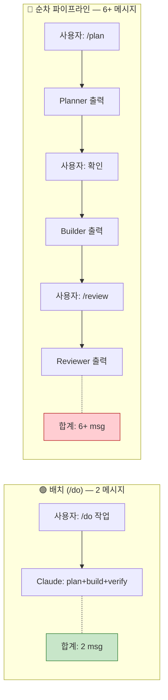

> **[English Version](README.md)**

<!-- Badges -->


# Claude Pro MinMax (CPMM)

> **토큰은 Minimum, 지능은 Maximum. Quota의 한계를 뛰어넘으세요.**

Pro Plan 제약에 최적화된 Claude Code 설정입니다.

---

> [!TIP]
> **🚀 3초 요약: 왜 이걸 써야 하나요?**
> 1.  **배치 + 저비용 모델:** `/do` 하나로 **Haiku(Opus의 1/5 비용)** 에게 plan+build+verify를 한 번에 처리시킵니다.
> 2.  **출력 비용 인식:** 에이전트 응답 예산 + CLI 필터링으로 **Input 대비 5배 비싼** Output 토큰을 절감합니다.
> 3.  **무비용 안전장치:** **11개 로컬 Hook** + **원자적 롤백** — API 토큰 소비 없이 모든 안전장치가 동작합니다.

---

## 🛠 설치 (Installation)

### 1. 필수 도구 준비
```bash
npm install -g @anthropic-ai/claude-code
npm install -g @mixedbread/mgrep
mgrep install-claude-code
brew install jq   # macOS (Linux: sudo apt-get install jq)
```

### 2. 한 줄 설치
```bash
/bin/bash -c "$(curl -fsSL https://raw.githubusercontent.com/move-hoon/claude-pro-minmax/main/install.sh)"
```

### 3. 설치 후 설정 (선택 사항)
**설치 스크립트 실행 중 Perplexity API 키와 출력 언어를 선택합니다.**
설치 시 언어를 건너뛰었다면 수동으로 설정할 수 있습니다:
- **비영어:** `~/.claude/rules/language.md`를 생성하여 원하는 언어 지정
- **영어 (기본값):** 파일 불필요. `~/.claude/rules/language.md`가 있으면 삭제

Perplexity를 설치 시 건너뛰었다면 나중에 수동으로 설정할 수 있습니다:
1. `~/.claude.json` 파일을 엽니다.
2. `mcpServers` 객체 안에 다음 내용을 추가하세요:
   ```json
   "perplexity": {
     "command": "npx",
     "args": ["-y", "@perplexity-ai/mcp-server"],
     "env": {
       "PERPLEXITY_API_KEY": "YOUR_API_KEY_HERE"
     }
   }
   ```

> **함께 포함된 MCP 서버 (기본 활성화):**
> - **Sequential Thinking**: 복잡한 로직 처리를 위한 강력한 추론 도구
> - **Context7**: 고급 문서 조회 및 컨텍스트 관리 도구

> **Note:** 설치 스크립트가 기존 `~/.claude` 설정을 자동으로 백업(`~/.claude-backup-{timestamp}`)합니다.

### 4. 프로젝트 초기화
> **Tip:** `claude` 실행 전, `~/.claude/project-templates/`를 참고하여 `.claude/CLAUDE.md`와 `settings.json`을 먼저 설정하세요. 그래야 최적화가 처음부터 적용됩니다.

---

## 🚀 빠른 시작 (Quick Start)

### 🤖 에이전트 워크플로우

CPMM은 작업의 복잡도에 따라 Sonnet(설계)과 Haiku(구현)를 자동으로 오가며 최적의 효율을 냅니다.

```mermaid
flowchart LR
    Start([User Request]) --> Cmd{Command?}

    Cmd -->|/plan| Plan[/"@planner (Sonnet)"/]
    Cmd -->|/do| Snap["📸 git stash push"]

    Snap --> Build[/"@builder (Haiku)"/]
    Plan -->|Blueprint| Build
    Build -- "Success" --> Drop["🗑️ git stash drop"]
    Drop --> Review[/"@reviewer (Haiku)"/]
    Build -- "Failure (2x)" --> Pop["⏪ git stash pop"]
    Pop --> Escalate("🚨 Escalate to Sonnet")

    Review --> Done([Done])
    Escalate -.-> Review

    classDef planner fill:#c8e6c9,stroke:#2e7d32,stroke-width:2px;
    classDef builder fill:#bbdefb,stroke:#1565c0,stroke-width:2px;
    classDef reviewer fill:#ffe0b2,stroke:#ef6c00,stroke-width:2px;
    classDef escalate fill:#ffcdd2,stroke:#b71c1c,stroke-width:2px;
    classDef done fill:#e0e0e0,stroke:#9e9e9e,stroke-width:2px,font-weight:bold;
    classDef snapshot fill:#e8eaf6,stroke:#3f51b5,stroke-width:2px;

    class Plan planner;
    class Build builder;
    class Review reviewer;
    class Escalate escalate;
    class Done done;
    class Snap,Drop,Pop snapshot;
```



### ⌨️ 명령어 가이드

**1. 핵심 명령어 (Core Commands)**

가장 자주 사용하는 필수 명령어입니다.

| 명령어 | 설명 | 추천 상황 |
| --- | --- | --- |
| `/do [작업]` | **Haiku**로 빠르게 구현 | 간단한 버그 수정, 스크립트 작성 |
| `/plan [작업]` | **Sonnet** 설계 → **Haiku** 구현 | 기능 추가, 리팩토링, 복잡한 로직 |
| `/review [대상]` | **Haiku** (읽기 전용) | 코드 리뷰 (파일 또는 디렉토리 지정 가능) |

<details>
<summary><strong>🚀 심화 명령어 (Advanced Commands) - Click to Expand</strong></summary>

더 정교한 작업이나 세션 관리를 위한 전체 명령어 목록입니다.

| 명령어 | 설명 | 추천 상황 |
| :--- | :--- | :--- |
| **🧠 심층 실행** | | |
| `/dplan [작업]` | **Sonnet** + Perplexity, Sequential Thinking, Context7 | 라이브러리 비교, 최신 기술 조사 (심층 연구) |
| `/do-sonnet` | **Sonnet**으로 직접 실행 | Haiku가 계속 실패할 때 수동 격상 |
| `/do-opus` | **Opus**로 직접 실행 | 매우 복잡한 문제 해결 (비용 주의) |
| **💾 세션/컨텍스트** | | |
| `/session-save` | 세션 요약 및 저장 | 작업 중단 시 (시크릿 자동 제거) |
| `/session-load` | 세션 불러오기 | 이전 작업 재개 |
| `/compact-phase` | 단계별 컨텍스트 압축 | 세션 중간에 컨텍스트 정리 필요 시 |
| `/load-context` | 컨텍스트 템플릿 로드 | 프론트/백엔드 초기 설정 시 |
| **🛠️ 유틸리티** | | |
| `/learn` | 패턴 학습 및 저장 | 자주 반복되는 오류나 선호 스타일 등록 |
| `/analyze-failures`| 오류 로그 분석 | 반복되는 에러 원인 파악 |
| `/watch` | 프로세스 모니터링 (tmux) | 장시간 빌드/테스트 관찰 |
| `/llms-txt` | 문서 가져오기 | 라이브러리 공식 문서를 LLM 포맷으로 로드 |

</details>

---

## 핵심 전략

Claude Pro Plan에는 Claude Code 사용 방식을 근본적으로 바꾸는 제약이 있습니다:

- **5시간 Rolling 리셋**: 5시간마다 사용량이 리셋되어 짧고 집중된 세션을 권장합니다.
- **메시지 기반 Quota (길이 민감)**: 대화가 길어질수록(Context가 쌓일수록) 메시지 하나당 차감되는 할당량이 기하급수적으로 늘어납니다. ([Claude Help Center](https://support.anthropic.com/en/articles/8325606-what-is-claude-pro))
- **주간 제한**: 과다 사용자에게 추가 주간 cap이 적용됩니다.

최적화 없이 기본 Claude Code를 Pro Plan에서 사용하면 quota가 빠르게 소진됩니다 — 단순 작업에 비싼 모델, 장황한 출력, 불필요한 메시지 왕복이 5시간 예산을 빠르게 소진합니다.

CPMM은 이 각각을 해결합니다:

| Pro Plan 과제 | CPMM 해법 |
|---|---|
| Opus가 단순 작업에도 quota 소모 | **Haiku 기본** (1/5 비용) — 필요할 때만 에스컬레이션 |
| 출력이 입력의 5배 비용 | **에이전트 응답 예산** (builder: 5줄, reviewer: 1줄 PASS) |
| 다단계 파이프라인이 메시지 낭비 | **배치 `/do`** — plan+build+verify를 ONE 메시지로 (2 msg vs 6+) |
| Context 증가 → 메시지당 비용 증가 | **3단계 compact 경고** (25/50/75) + 75% 자동 컴팩션 |
| 실패 시 dirty state 방치 | **원자적 롤백** (`git stash` 스냅샷 → 실패 시 깨끗한 복원) |
| Hook/스크립트가 API 호출 소비 | **11개 로컬 Hook** — 모든 강제 실행이 로컬, API 비용 0 |

### 1. 목표 (Goal)
**Pro Plan의 5시간 Quota 창 내에서 세션 지속 가능성 최대화**

이 설정은 작업당 Quota 소비를 줄여 생산적인 작업 시간을 연장하도록 설계되었습니다. 목표는 "제한 우회"가 아니라, **리소스 효율성 최적화**를 통해 할당량을 소진하지 않고 더 오래 작업하는 것입니다.

### 2. 접근 방식 (Approach)
Anthropic이 정확한 알고리즘을 공개하지 않았지만, Quota 소비는 다음 요인에 영향을 받습니다. 이 프로젝트는 하나의 원칙으로 모두 최적화합니다: **메시지당 최대 가치 (Maximum Value Per Message).**

* **모델 비용 (핵심 — 5배):** Haiku는 Opus의 1/5 비용 (API 가격 기준). 작업 가능한 최저 비용 모델 사용.
* **출력 토큰 (고영향 — 5배):** Output은 Input의 5배 비용 (API 가격 기준). 모든 에이전트에 응답 예산 적용.
* **메시지 수 (직접):** 메시지 수 = quota 소비. `/do` 한 번에 plan+build+verify를 배치 처리.
* **CLI 필터링:** `jq`, `mgrep`로 도구 출력 토큰 감소, input과 output 모두 축소.

### 3. 실행 전략: 가치 우선 워크플로우

1.  **기본: 배치 실행 (`/do`)**
    * 단순 작업 (1-3 파일): `/do`가 plan+build+verify를 한 번에 처리합니다.
    * 플래너 오버헤드 없음. 단계 사이 사람 확인 없음.
    * **결과: 2 메시지** (사용자 요청 + Claude 응답) vs 순차 파이프라인의 6+ 메시지.

2.  **선택: 순차 파이프라인 (`/plan`)**
    * 중-복잡 작업 (4+ 파일): `/plan` → `@builder` → `@reviewer`.
    * 단계 사이에 사람 확인이 필요할 때 사용합니다.
    * 설계 단계 자체를 검증한 후 구현해야 할 때 사용합니다.

3.  **작업당 비용 최소화**
    * `@builder` (Haiku): 구현 담당 (Opus의 1/5 비용).
    * `@planner` (Sonnet): 아키텍처 설계 (균형 잡힌 능력과 비용).
    * **Opus**: 에스컬레이션 전용 — 명시적 `/do-opus`로 비용 가시화.

4.  **안전한 에스컬레이션 경로 (Safety Ladder)**
    * Haiku 실패 (2회 재시도 후) → Sonnet으로 격상 (`/do-sonnet`).
    * Sonnet 실패 → Opus로 격상 (`/do-opus`).
    * 명시적 모델 선택으로 비용을 인지하게 합니다.

5.  **원자적 롤백 (실패 복구)**
    * `/do`, `/do-sonnet`, `/do-opus` 실행 전 `git stash` 스냅샷을 생성합니다.
    * 성공 시: 스냅샷 제거 (오버헤드 없음).
    * 실패 시 (2회 재시도 후): `git stash pop`으로 실행 전 상태 복원.
    * **이점**: 즉시 에스컬레이션 가능한 깨끗한 상태 — 수동 정리 불필요, 실패당 **2-4 메시지 절약**.

---

## 📊 결과 및 비교

**주요 기대 효과:**
✅ 모델 비용 최적화로 훨씬 긴 세션 (Haiku = Opus의 1/5).
✅ 배치 실행(`/do`)으로 작업당 더 적은 메시지.
✅ 엄격한 에이전트 응답 예산으로 출력 토큰 감소.

> [!NOTE]
> **참고:** Anthropic의 정확한 Quota 알고리즘은 비공개입니다. 본 설정은 API 가격 및 검증된 비용 요인을 기반으로 최적화하며, 실제 결과는 작업 복잡도에 따라 달라질 수 있습니다.

### 비용 비교: 배치 vs 순차

> 진짜 절약은 **더 적고, 더 싼 메시지를 보내는 것**에서 오지, 실행 순서에서 오지 않습니다.



| 요소 | 측정 효과 | 메커니즘 |
|------|----------|----------|
| **모델 선택** | **5배 비용 절감** | Haiku ($1/MTok) vs Opus ($5/MTok) — API 가격 |
| **출력 예산** | **~60% 출력 감소** | 에이전트 응답 제한 (builder: 5줄, reviewer: 1줄 PASS) |
| **배치 실행** | **~3배 메시지 감소** | `/do` = 2 msg vs 순차 파이프라인 = 6+ msg |
| **CLI 필터링** | **~50% 도구 출력 감소** | `jq`, `mgrep`로 도구 결과의 input 토큰 감소 |
| **원자적 롤백** | **실패당 2-4 msg 절약** | `/do` 전 `git stash` 스냅샷 — 실패 시 깨끗한 상태, API 비용 0 |

---

<details>
<summary><strong>🔬 아키텍처 분석 — 설계 결정의 수학적 근거</strong></summary>

### 핵심 철학 검증

CPMM의 "메시지당 최대 가치"는 Pro Plan quota 비용 함수를 직접 최소화합니다:

```
Total_Quota ≈ Σ f(model_weight_i, context_size_i, output_size_i)
```

| 변수 | CPMM 메커니즘 | 감소율 |
|------|--------------|--------|
| `model_weight` | Opus(1.67x) 대신 Haiku(0.33x) 사용 | **5배** (API 가격) |
| `output_size` | 에이전트 응답 예산 (builder: 5줄, reviewer: 1줄) | **~60%** (추정) |
| `context_size` | CLI 필터링 (`jq`, `mgrep`) + 75% 자동 컴팩션 | **~50%** 도구 출력 (추정) |

**알려진 제한**: 세션 내 메시지가 쌓이면 context가 증가하여 후반 메시지가 더 비쌈. 3단계 컴팩션 경고 (25/50/75 tool calls) + 75% 자동 컴팩션으로 완화.

### 하이브리드 전략: 배치 기본 + 순차 폴백의 수학적 근거

**p** = `/do` (배치) 실행 실패 후 `/plan` (순차)로 에스컬레이션할 확률

| 전략 | 공식 | 100개 작업당 메시지 |
|------|------|-------------------|
| 항상 `/plan` (순차) | 6 × 100 | **600** |
| 하이브리드 (`/do` 기본) | 2×(1−p)×100 + (4+6)×p×100 | **200 + 800p** |

**손익분기점**: 200 + 800p = 600 → **p = 0.50 (50%)**

| 실패율 (p) | 하이브리드 비용 | 순차 비용 | 절약률 |
|:-:|:-:|:-:|:-:|
| 10% | 280 msg | 600 msg | **53%** |
| 20% | 360 msg | 600 msg | **40%** |
| 30% | 440 msg | 600 msg | **27%** |
| 40% | 520 msg | 600 msg | **13%** |
| 50% | 600 msg | 600 msg | 0% (손익분기) |

**결론**: 하이브리드 전략은 현실적인 실패율(50% 미만) 모든 구간에서 항상-순차 전략보다 우월합니다.

### 원자적 롤백 비용-편익

| 시나리오 | 롤백 없음 | 롤백 있음 | 절약 |
|----------|:-:|:-:|:-:|
| `/do` 성공 | 2 msg | 2 msg | 0 |
| `/do` 실패 (2회 재시도) | 4 msg + 2-4 msg 정리 | 4 msg (자동 복원) | **2-4 msg** |
| 롤백 API 비용 | — | 0 (`git stash`는 로컬) | **0** |

### 최적화 요소 종합

| 요소 | 효과 | 근거 | 상태 |
|------|------|------|:----:|
| 모델 선택 | **5배** 비용 절감 | API 가격: Haiku $1 vs Opus $5 /MTok | 검증됨 |
| 출력 비용 | **5배** 비용 배수 | API 가격: Output = Input의 5배 | 검증됨 |
| 배치 실행 | **~3배** 메시지 감소 | `/do` = 2 msg vs `/plan` = 6+ msg | 측정됨 |
| CLI 필터링 | **~50%** 도구 출력 감소 | `jq`, `mgrep` 필드 선택 | 추정 |
| 원자적 롤백 | 실패당 **2-4 msg** 절약 | `git stash`로 dirty state 방지 | 추정 |

> **종합 효율: 5-8배** (모델 선택 5x 기반, 출력 감소와 메시지 배치로 증폭. 롤백은 낭비 방지이며 배수는 변경 없음.)

</details>

---

## 📚 문서 가이드 (Documentation Hub)

이 프로젝트는 컴포넌트별 상세 문서를 제공합니다. 구체적인 동작 원리와 커스터마이징 방법은 아래 링크를 참고하세요.

| 구분 | 설명 | 상세 문서 (클릭) |
| :--- | :--- | :--- |
| **🤖 Agents** | Planner, Builder, Reviewer 등 에이전트의 역할과 프롬프트 정의 | [📂 **Agents 가이드**](.claude/agents/README.ko.md) |
| **🕹️ Commands** | /plan, /do, /review 등 14개 명령어 사용법 | [📂 **Commands 가이드**](.claude/commands/README.ko.md) |
| **🪝 Hooks** | Pre-check, Auto-format 등 11개 자동화 스크립트 로직 | [📂 **Hooks 가이드**](scripts/hooks/README.ko.md) |
| **📏 Rules** | 보안, 코드 스타일, 위험 명령어 차단 정책 | [📂 **Rules 가이드**](.claude/rules/README.ko.md) |
| **🧠 Skills** | CLI Wrapper 등 도구 기술 명세 | [📂 **Skills 가이드**](.claude/skills/README.ko.md) |
| **🔧 Contexts** | Backend/Frontend 프로젝트별 컨텍스트 템플릿 | [📂 **Contexts 가이드**](.claude/contexts/README.ko.md) |
| **💾 Sessions** | 세션 요약 저장 및 관리 구조 | [📂 **Sessions 가이드**](.claude/sessions/README.ko.md) |
| **🛠️ Scripts** | Verify, Build, Test 범용 스크립트 모음 | [📂 **Scripts 가이드**](scripts/README.ko.md) |
| **⚙️ Runtime** | 프로젝트 언어/프레임워크 자동 감지 시스템 | [📂 **Runtime 가이드**](scripts/runtime/README.ko.md) |
| **🔌 Adapters** | 언어별(Java, Node, Go 등) 빌드 어댑터 상세 | [📂 **Adapters 가이드**](scripts/runtime/adapters/README.ko.md) |
| **🎓 Learned** | /learn 명령어로 축적된 패턴 데이터 | [📂 **Learned Skills**](.claude/skills/learned/README.ko.md) |

---

## 📂 프로젝트 구조

<details>
<summary><strong>📁 파일 트리 보기 (Click to Expand)</strong></summary>

```text
claude-pro-minmax
├── .claude.json                # 글로벌 MCP 설정 (User Scope)
├── install.sh                  # 원클릭 설치 스크립트
├── LICENSE                     # MIT 라이선스
├── README.md                   # 영문 문서
├── README.ko.md                # 국문 문서
├── .claude/
│   ├── CLAUDE.md               # 핵심 지침 (모든 세션에 로드됨)
│   ├── settings.json           # 프로젝트 설정 (권한, 훅, 환경변수)
│   ├── settings.local.json     # 로컬 사용자 설정 (Git 제외)
│   ├── agents/                 # 에이전트 정의
│   │   ├── planner.md          # Sonnet: 아키텍처 및 설계 결정
│   │   ├── dplanner.md         # Sonnet+MCP: 외부 도구를 활용한 심층 계획
│   │   ├── builder.md          # Haiku: 코드 구현 및 리팩토링
│   │   └── reviewer.md         # Haiku: 읽기 전용 코드 리뷰
│   ├── commands/               # 슬래시 명령어
│   │   ├── plan.md             # 아키텍처 계획 (Sonnet -> Haiku)
│   │   ├── dplan.md            # 심층 리서치 계획 (Sequential Thinking)
│   │   ├── do.md               # 직접 실행 (기본 Haiku)
│   │   ├── do-sonnet.md        # Sonnet 모델로 실행
│   │   ├── do-opus.md          # Opus 모델로 실행
│   │   ├── review.md           # 코드 리뷰 명령어 (읽기 전용)
│   │   ├── watch.md            # tmux를 통한 파일/프로세스 모니터링
│   │   ├── session-save.md     # 현재 세션 상태 저장
│   │   ├── session-load.md     # 이전 세션 상태 복원
│   │   ├── compact-phase.md    # 단계별 컨텍스트 압축 가이드
│   │   ├── load-context.md     # 사전 정의된 컨텍스트 템플릿 로드
│   │   ├── learn.md            # 새로운 패턴을 메모리에 저장
│   │   ├── analyze-failures.md # 도구 실패 로그 분석
│   │   └── llms-txt.md         # LLM 최적화 문서 조회
│   ├── rules/                  # 행동 규칙
│   │   ├── critical-actions.md # 위험 명령어 차단 (rm -rf, git push -f, etc.)
│   │   ├── code-style.md       # 코딩 컨벤션 및 표준
│   │   └── security.md         # 보안 모범 사례
│   ├── skills/                 # 도구 능력
│   │   ├── cli-wrappers/       # 경량 CLI 래퍼 (MCP 오버헤드 대체)
│   │   └── learned/            # /learn 명령어로 축적된 패턴
│   ├── contexts/               # 컨텍스트 템플릿
│   │   ├── backend-context.md  # 백엔드 전용 지침
│   │   └── frontend-context.md # 프론트엔드 전용 지침
│   ├── logs/                   # 로그 디렉토리
│   │   └── tool-failures.log   # 도구 실패 기록
│   └── sessions/               # 저장된 세션 요약 (Markdown)
├── scripts/                    # 유틸리티 및 자동화
│   ├── verify.sh               # 범용 검증 스크립트
│   ├── build.sh                # 범용 빌드 스크립트
│   ├── test.sh                 # 범용 테스트 스크립트
│   ├── lint.sh                 # 범용 린트 스크립트
│   ├── commit.sh               # 표준화된 git commit 도우미
│   ├── create-branch.sh        # 브랜치 생성 도우미
│   ├── snapshot.sh             # /do 명령의 원자적 롤백 (git stash)
│   ├── analyze-failures.sh     # /analyze-failures용 로그 분석 도구
│   ├── scrub-secrets.js        # 세션 저장 시 시크릿 제거 로직
│   ├── hooks/                  # 제로-코스트 Hooks (자동화 체크)
│   │   ├── critical-action-check.sh # 위험 명령어 사전 차단
│   │   ├── tool-failure-log.sh      # 실패 로그 파일 기록
│   │   ├── pre-compact.sh           # 압축 전처리기
│   │   ├── compact-suggest.sh       # 3단계 컴팩션 경고 (25/50/75)
│   │   ├── post-edit-format.sh      # 편집 후 자동 포맷팅
│   │   ├── readonly-check.sh        # 리뷰어 읽기 전용 강제
│   │   ├── retry-check.sh           # 빌더 2회 재시도 제한 강제
│   │   ├── session-start.sh         # 세션 초기화 로직
│   │   ├── session-cleanup.sh       # 종료 시 정리 및 시크릿 제거
│   │   ├── stop-collect-context.sh  # 중단 시 컨텍스트 수집
│   │   └── notification.sh          # 데스크탑 알림
│   └── runtime/                # 런타임 자동 감지
│       ├── detect.sh           # 프로젝트 유형 감지 로직
│       └── adapters/           # 언어별 빌드 어댑터
│           ├── _interface.sh   # 어댑터 인터페이스 정의
│           ├── _template.sh    # 새 어댑터용 템플릿
│           ├── generic.sh      # 범용 폴백 어댑터
│           ├── go.sh           # Go/Golang 어댑터
│           ├── jvm.sh          # Java/Kotlin/JVM 어댑터
│           ├── node.sh         # Node.js/JavaScript/TypeScript 어댑터
│           ├── python.sh       # Python 어댑터
│           └── rust.sh         # Rust 어댑터
└── project-templates/          # 언어 및 프레임워크 템플릿
    ├── backend/                # 백엔드 프로젝트 템플릿
    └── frontend/               # 프론트엔드 프로젝트 템플릿
```

</details>

## 지원 런타임

| 런타임 | 빌드 도구 | Detection Files |
|--------|----------|----------|
| JVM | Gradle, Maven | `build.gradle.kts`, `pom.xml` |
| Node | npm, pnpm, yarn, bun | `package.json` |
| Rust | Cargo | `Cargo.toml` |
| Go | Go Modules | `go.mod` |
| Python | pip, poetry, uv | `pyproject.toml`, `requirements.txt` |

새 런타임을 추가하려면 `scripts/runtime/adapters/_template.sh`를 복사하여 구현하세요.

---

## FAQ

<details>
<summary><strong>Q: 이 설정은 어떻게 Pro Plan quota를 최적화하나요?</strong></summary>

A: Anthropic의 정확한 quota 알고리즘은 공개되지 않았습니다. 세 가지 축으로 최적화합니다:
- **모델 비용** (검증됨): Haiku는 API 가격 기준 Opus의 1/5.
- **출력 감소** (검증됨): Output 토큰은 Input의 5배 비용. 에이전트 응답 예산 + CLI 필터링으로 출력 감소.
- **메시지 효율**: `/do`가 plan+build+verify를 한 번에 처리 (순차 파이프라인의 6+ 메시지 vs 2 메시지).

사람 확인이 필요한 작업에는 `/plan`으로 단계별 순차 실행을 사용하세요.
</details>

<details>
<summary><strong>Q: 5시간 내내 Claude를 사용할 수 있나요?</strong></summary>

A: **보장되지 않습니다**. 세션 길이는 다음에 따라 다릅니다:
- 작업 복잡도 (간단한 수정 vs. 대규모 리팩토링)
- 모델 사용 (주로 Haiku vs. 주로 Opus)
- 컨텍스트 크기 (작은 파일 vs. 전체 코드베이스)

이 설정은 Pro Plan 제약 내에서 세션 길이를 최대화하도록 설계되었지만, quota 한계를 우회할 수는 없습니다.
</details>

<details>
<summary><strong>Q: Max Plan에서도 사용할 수 있나요?</strong></summary>

A: 네, 하지만 이러한 최적화가 필요하지 않을 수 있습니다. Max Plan은 훨씬 높은 사용 제한을 제공하여 Pro Plan 제약이 덜 관련됩니다. Max Plan 사용자라면:
- Opus를 기본 모델로 quota 걱정 없이 사용 가능
- Git Worktrees와 병렬 세션이 실용적
- 출력 예산과 배치 실행은 여전히 좋은 습관이지만 필수는 아님

이 설정은 Pro Plan의 5시간 rolling reset과 메시지 기반 quota 시스템을 위해 특별히 설계되었습니다.
</details>

<details>
<summary><strong>Q: 기존 Claude Code 설정과 충돌하나요?</strong></summary>

A: `~/.claude/` 디렉토리를 덮어씁니다. 설치 전에 기존 설정을 백업해 주세요.
</details>

<details>
<summary><strong>Q: 어떤 OS를 지원하나요?</strong></summary>

A: macOS와 Linux를 지원합니다. Windows는 WSL을 통해 사용 가능합니다.
</details>

<details>
<summary><strong>Q: 왜 모든 작업에 Opus를 사용하지 않나요?</strong></summary>

A: API 가격(컴퓨팅 비용 반영)을 보면 Opus는 Sonnet이나 Haiku보다 훨씬 비쌉니다. 정확한 Pro Plan quota 영향은 공개되지 않았지만, 모든 작업에 Opus를 사용하면 quota가 훨씬 빠르게 소진될 것입니다. 명시적 모델 선택(`/do-opus`)으로 비싼 모델 사용 시 인지할 수 있도록 합니다.
</details>

<details>
<summary><strong>Q: /do 실행 중 실패하면 어떻게 되나요?</strong></summary>

A: CPMM은 **원자적 롤백**을 사용합니다. `/do` 실행 전 `git stash push`로 스냅샷을 저장합니다. 2회 재시도 후 실패하면 `git stash pop`이 작업 트리를 실행 전 상태로 복원합니다. dirty state를 방지하고 수동 정리에 소비될 2-4 메시지를 절약합니다.

- 비용: 0 (git stash는 로컬 작업)
- 제한: 기존(tracked) 파일만 추적. 새로 생성된 파일은 수동 제거 필요.
</details>

---

## Credits

- **[affaan-m/everything-claude-code](https://github.com/affaan-m/everything-claude-code)** — Anthropic 해커톤 우승작. 이 프로젝트의 기반입니다.
- [Claude Code 공식 문서](https://code.claude.com/docs/en/)

## 기여

오픈소스 프로젝트입니다. 기여를 환영합니다!

1. 저장소 Fork
2. 기능 브랜치 생성 (`git checkout -b feature/amazing-feature`)
3. 변경 사항 커밋 (`git commit -m 'feat: Add amazing feature'`)
4. 브랜치에 Push (`git push origin feature/amazing-feature`)
5. Pull Request 생성

## 라이선스

MIT License
