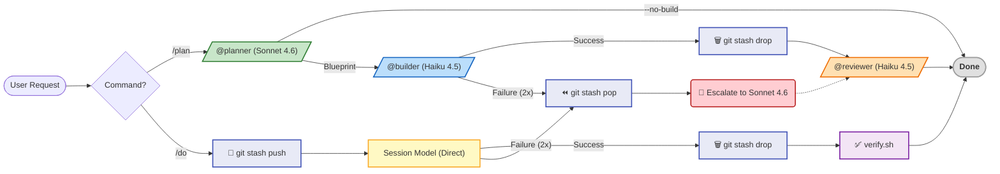

> **[한국어 버전](README.ko.md)**

<!-- Badges -->


# Claude Pro MinMax (CPMM)

> **Minimize waste. Maximize validated work.**

CPMM helps Pro users complete more verified tasks before reset through model routing, output control, and local safety rails.

> **Already installed? Start here: [User Guide](docs/USER-MANUAL.md)**

---

> [!TIP]
> **🚀 3-Second Summary: Why use this?**
> 1.  **Batch Execution:** Use `/do` to keep implementation and verification in one flow, and escalate to `/do-sonnet`/`/do-opus` only when needed.
> 2.  **Output Cost Control:** Use response budgets and CLI filtering to reduce unnecessary output tokens.
> 3.  **Local Safety Rails:** Local hooks and atomic rollback help you recover quickly on failure.

---

## 🛠 Installation

### 1. Prerequisites
```bash
npm install -g @anthropic-ai/claude-code
npm install -g @mixedbread/mgrep  # optional, recommended: ~50% output reduction
mgrep install-claude-code
brew install jq   # macOS (Linux: sudo apt-get install jq)
brew install tmux # optional: required for /watch (Linux: sudo apt-get install tmux)
```

### 2. npm / npx Install (Recommended)
```bash
npx claude-pro-minmax@latest install
```

Or install globally:
```bash
npm install -g claude-pro-minmax
cpmm install
```

### 3. One-Line Install (curl)
```bash
/bin/bash -c "$(curl -fsSL https://raw.githubusercontent.com/move-hoon/claude-pro-minmax/main/install.sh)"
```

### 4. Manual Install
```bash
git clone https://github.com/move-hoon/claude-pro-minmax.git
cd claude-pro-minmax
less install.sh
bash install.sh
```

### 5. Post-Install Configuration (Optional)
**The installation script will ask for your Perplexity API Key and output language.**
If you skipped language selection, you can configure it manually:
- **Non-English:** Create `~/.claude/rules/language.md` with your preferred language
- **English (default):** No file needed. Remove `~/.claude/rules/language.md` if it exists

If you skipped Perplexity setup during installation, you can set it up manually:
1. Open `~/.claude.json`.
2. Add the following to the `mcpServers` object:
   ```json
   "perplexity": {
     "command": "npx",
     "args": ["-y", "@perplexity-ai/mcp-server"],
     "env": {
       "PERPLEXITY_API_KEY": "YOUR_API_KEY_HERE"
     }
   }
   ```

> **Other included MCP servers (Enabled by default):**
> - **Sequential Thinking**: Powerful reasoning tool for complex logic.
> - **Context7**: Advanced documentation fetching and context management.

> **Note:** The installation script automatically backs up your existing `~/.claude` settings (`~/.claude-backup-{timestamp}`).

### 6. Project Initialization
> **Tip:** Before running `claude`, initialize your project by referencing templates in this repository's `project-templates/` directory. (`install.sh` does not copy `project-templates` into `~/.claude`.)

### 7. Verify Installation
```bash
npx claude-pro-minmax@latest doctor
# or (if installed globally)
cpmm doctor
```

---

## 🚀 Quick Start

### 🤖 Agent Workflow

CPMM provides layered model routing: `/plan` chains @planner (Sonnet 4.6) → @builder (Haiku 4.5) for complex tasks, while `/do` executes directly in the current session model for speed.



### ⌨️ Command Guide

**1. Core Commands**

Essential commands used most frequently.

| Command | Description | Recommended Situation |
| --- | --- | --- |
| `/do [task]` | Rapid implementation (session model) | Simple bug fixes, script writing |
| `/plan [task]` | **Sonnet 4.6** Design → **Haiku 4.5** Implementation | Feature additions, refactoring, complex logic |
| `/review [target]` | **Haiku 4.5** (Read-only) | Code review (Specify file or directory) |

> **Cost Optimization Tip:** Set your session model to Haiku (`/model haiku`) before using `/do` for simple tasks — same **1/5 API input-token price** as @builder. Use `/do-sonnet` or `/plan` for complex tasks.

<details>
<summary><strong>🚀 Advanced Commands - Click to Expand</strong></summary>

Full command list for more sophisticated tasks or session management.

| Command | Description | Recommended Situation |
| :--- | :--- | :--- |
| **🧠 Deep Execution** | | |
| `/dplan [task]` | **Sonnet 4.6** + Perplexity, Sequential Thinking, Context7 | Library comparison, latest tech research (Deep Research) |
| `/do-sonnet` | Execute directly with **Sonnet 4.6** | Manual escalation when Haiku 4.5 keeps failing |
| `/do-opus` | Execute directly with **Opus 4.6** | Resolving extremely complex problems (Cost caution) |
| **💾 Session/Context** | | |
| `/session-save` | Summarize and save session | When pausing work (Auto-removal of secrets) |
| `/session-load` | Load session | Resuming previous work |
| `/compact-phase` | Step-by-step context compaction | When context cleanup is needed mid-session |
| `/load-context` | Load context templates | Initial setup for frontend/backend |
| **🛠️ Utility** | | |
| `/learn` | Learn and save patterns | Registering frequently recurring errors or preferred styles |
| `/analyze-failures` | Analyze error logs | Identifying causes of recurring errors |
| `/watch` | Process monitoring (tmux) | Observing long-running builds/tests |
| `/llms-txt` | Fetch documentation | Loading official library docs in LLM format |

</details>

---

## Core Strategy

> [!NOTE]
> Anthropic does not publish the exact Pro quota formula. This README focuses on practical operating rules you can use immediately. For archived experiment evidence backing this strategy, see the [Core Strategy Experiment Archive](docs/CORE_STRATEGY_EXPERIMENT_ARCHIVE.md).

### Goal

**Maximize validated throughput per quota window** by reducing quota spend per validated task.

### Operating Principles

1. Start with `Haiku + /do`. (Set `/model haiku` first if needed.)
2. Use `/do` for straightforward tasks (usually 1-3 files).
3. Use `/plan` when architecture judgment or multi-file checkpoints are needed.
4. If Haiku keeps failing, escalate to `Sonnet + /do-sonnet`.
5. Use `Opus + /do-opus` only when truly necessary.
6. Keep context lean with timely compaction.
7. For measured values and experiment context, see the [experiment archive](docs/CORE_STRATEGY_EXPERIMENT_ARCHIVE.md).

---

## 📚 Documentation Hub

This project provides detailed documentation for each component. Refer to the links below for specific operating principles and customization methods.

| Category | Description | Detailed Docs (Click) |
| :--- | :--- | :--- |
| **📊 Strategy Evidence** | Archived experiment results backing core strategy | [📂 **Experiment Archive**](docs/CORE_STRATEGY_EXPERIMENT_ARCHIVE.md) |
| **🧭 User Guide** | Practical operating scenarios right after installation | [📂 **User Guide**](docs/USER-MANUAL.md) |
| **🤖 Agents** | Definitions of roles and prompts for Planner, Builder, Reviewer, etc. | [📂 **Agents Guide**](.claude/agents/README.md) |
| **🕹️ Commands** | Usage of 14 commands including /plan, /do, /review | [📂 **Commands Guide**](.claude/commands/README.md) |
| **🪝 Hooks** | Logic of 11 automation scripts including Pre-check, Auto-format | [📂 **Hooks Guide**](scripts/hooks/README.md) |
| **📏 Rules** | Policies for Security, Code Style, Critical Actions | [📂 **Rules Guide**](.claude/rules/README.md) |
| **🧠 Skills** | Technical specifications for tools like CLI Wrappers | [📂 **Skills Guide**](.claude/skills/README.md) |
| **🔧 Contexts** | Context templates for Backend/Frontend projects | [📂 **Contexts Guide**](.claude/contexts/README.md) |
| **💾 Sessions** | Structure for session summary storage and management | [📂 **Sessions Guide**](.claude/sessions/README.md) |
| **🛠️ Scripts** | Collection of general-purpose scripts for Verify, Build, Test | [📂 **Scripts Guide**](scripts/README.md) |
| **⚙️ Runtime** | Automatic project language/framework detection system | [📂 **Runtime Guide**](scripts/runtime/README.md) |
| **🔌 Adapters** | Details on build adapters by language (Java, Node, Go, etc.) | [📂 **Adapters Guide**](scripts/runtime/adapters/README.md) |
| **🎓 Learned** | Pattern data accumulated through the /learn command | [📂 **Learned Skills**](.claude/skills/learned/README.md) |

---

## 📂 Project Structure

<details>
<summary><strong>📁 View File Tree (Click to Expand)</strong></summary>

```text
claude-pro-minmax
├── .claude.json                # Global MCP Settings (User Scope)
├── .claudeignore               # Files excluded from Claude's context
├── .gitignore                  # Git ignore rules
├── install.sh                  # One-click installation script
├── LICENSE                     # MIT License
├── README.md                   # English Documentation
├── README.ko.md                # Korean Documentation
├── .claude/
│   ├── CLAUDE.md               # Core Instructions (Loaded in all sessions)
│   ├── settings.json           # Project Settings (Permissions, hooks, env vars)
│   ├── settings.local.example.json # Template for ~/.claude/settings.local.json
│   ├── agents/                 # Agent Definitions
│   │   ├── planner.md          # Sonnet 4.6: Architecture and design decisions
│   │   ├── dplanner.md         # Sonnet 4.6+MCP: Deep planning utilizing external tools
│   │   ├── builder.md          # Haiku 4.5: Code implementation and refactoring
│   │   └── reviewer.md         # Haiku 4.5: Read-only code review
│   ├── commands/               # Slash Commands
│   │   ├── plan.md             # Architecture planning (Sonnet -> Haiku)
│   │   ├── dplan.md            # Deep research planning (Sequential Thinking)
│   │   ├── do.md               # Direct execution (Default: Haiku)
│   │   ├── do-sonnet.md        # Execute with Sonnet model
│   │   ├── do-opus.md          # Execute with Opus model
│   │   ├── review.md           # Code review command (Read-only)
│   │   ├── watch.md            # File/process monitoring via tmux
│   │   ├── session-save.md     # Save current session state
│   │   ├── session-load.md     # Restore previous session state
│   │   ├── compact-phase.md    # Guide for step-by-step context compaction
│   │   ├── load-context.md     # Load pre-defined context templates
│   │   ├── learn.md            # Save new patterns to memory
│   │   ├── analyze-failures.md # Analyze tool failure logs
│   │   └── llms-txt.md         # View LLM-optimized documentation
│   ├── rules/                  # Behavioral Rules
│   │   ├── critical-actions.md # Block dangerous commands (rm -rf, git push -f, etc.)
│   │   ├── code-style.md       # Coding conventions and standards
│   │   └── security.md         # Security best practices
│   ├── skills/                 # Tool Capabilities
│   │   ├── cli-wrappers/       # Lightweight CLI wrappers (Replaces MCP overhead)
│   │   │   ├── SKILL.md        # Skill definition and usage
│   │   │   └── references/     # CLI reference documentation
│   │   │       ├── github-cli.md
│   │   │       └── mgrep.md
│   │   └── learned/            # Patterns accumulated through /learn command
│   ├── contexts/               # Context Templates
│   │   ├── backend-context.md  # Backend-specific instructions
│   │   └── frontend-context.md # Frontend-specific instructions
│   └── sessions/               # Saved session summaries (Markdown)
├── .github/
│   └── ISSUE_TEMPLATE/
│       └── feedback.md         # Issue template for feedback
├── docs/                       # Project Documentation
│   ├── CORE_STRATEGY_EXPERIMENT_ARCHIVE.md    # Experiment evidence (EN)
│   ├── CORE_STRATEGY_EXPERIMENT_ARCHIVE.ko.md # Experiment evidence (KO)
│   ├── USER-MANUAL.md          # User manual (EN)
│   └── USER-MANUAL.ko.md       # User manual (KO)
├── scripts/                    # Utilities and Automation
│   ├── verify.sh               # General-purpose verification script
│   ├── build.sh                # General-purpose build script
│   ├── test.sh                 # General-purpose test script
│   ├── lint.sh                 # General-purpose lint script
│   ├── commit.sh               # Standardized git commit helper
│   ├── create-branch.sh        # Branch creation helper
│   ├── snapshot.sh             # Atomic rollback for /do commands (git stash)
│   ├── analyze-failures.sh     # Log analysis tool for /analyze-failures
│   ├── scrub-secrets.js        # Logic to remove secrets when saving sessions
│   ├── hooks/                  # Zero-Cost Hooks (Automated checks)
│   │   ├── critical-action-check.sh # Pre-block dangerous commands
│   │   ├── tool-failure-log.sh      # Record failure log files
│   │   ├── pre-compact.sh           # Compaction pre-processor
│   │   ├── compact-suggest.sh       # 3-tier compact warnings (25/50/75)
│   │   ├── post-edit-format.sh      # Automatic formatting after editing
│   │   ├── readonly-check.sh        # Enforce read-only for reviewer
│   │   ├── retry-check.sh           # Enforce 2-retry limit for builder
│   │   ├── session-start.sh         # Session initialization logic
│   │   ├── session-cleanup.sh       # Cleanup and secret removal on exit
│   │   ├── stop-collect-context.sh  # Collect context on interruption
│   │   └── notification.sh          # Desktop notifications
│   └── runtime/                # Runtime Auto-detection
│       ├── detect.sh           # Project type detection logic
│       └── adapters/           # Build adapters by language
│           ├── _interface.sh   # Adapter interface definition
│           ├── _template.sh    # Template for new adapters
│           ├── generic.sh      # Generic fallback adapter
│           ├── go.sh           # Go/Golang adapter
│           ├── jvm.sh          # Java/Kotlin/JVM adapter
│           ├── node.sh         # Node.js/JavaScript/TypeScript adapter
│           ├── python.sh       # Python adapter
│           └── rust.sh         # Rust adapter
└── project-templates/          # Language and Framework Templates
    ├── backend/                # Backend project template
    │   └── .claude/
    │       ├── CLAUDE.md
    │       └── settings.json
    └── frontend/               # Frontend project template
        └── .claude/
            ├── CLAUDE.md
            └── settings.json
```

</details>

## Supported Runtimes

| Runtime | Build Tool | Detection Files |
|--------|----------|----------|
| JVM | Gradle, Maven | `build.gradle.kts`, `pom.xml` |
| Node | npm, pnpm, yarn, bun | `package.json` |
| Rust | Cargo | `Cargo.toml` |
| Go | Go Modules | `go.mod` |
| Python | pip, poetry, uv | `pyproject.toml`, `setup.py`, `requirements.txt` |

To add a new runtime, copy and implement `scripts/runtime/adapters/_template.sh`.

---

## FAQ

<details>
<summary><strong>Q: How does this configuration optimize the Pro Plan quota?</strong></summary>

A: Anthropic's exact quota algorithm is not public. Optimization is based on three pillars:
- **Low-cost model-first path**: Start implementation with Haiku, and escalate to Sonnet/Opus only when needed.
- **Output-cost awareness**: Output tokens are priced higher than input, so response budgets/filtering reduce payload.
- **Workflow simplification**: Use `/do` and `/plan` by task type to avoid unnecessary high-cost turns.

For measured evidence, see [docs/CORE_STRATEGY_EXPERIMENT_ARCHIVE.md](docs/CORE_STRATEGY_EXPERIMENT_ARCHIVE.md).
</details>

<details>
<summary><strong>Q: Can I use Claude for the full 5 hours?</strong></summary>

A: **It is not guaranteed**. Session length depends on:
- Task complexity (simple fixes vs. large-scale refactoring).
- Model usage (mainly Haiku vs. mainly Opus).
- Context size (small files vs. entire codebase).

This configuration is designed to maximize session length within Pro Plan constraints, but it cannot bypass quota limits.
</details>

<details>
<summary><strong>Q: Can it be used on the Max Plan?</strong></summary>

A: Yes, but these optimizations may not be necessary. The Max Plan provides much higher usage limits, making Pro Plan constraints less relevant. For Max Plan users:
- Opus can be used as the default model without quota concerns.
- Git Worktrees and parallel sessions are practical.
- Output budgets and batch execution are still good practices, but not critical.

This configuration is specifically designed for the Pro Plan's 5-hour rolling reset and message-based quota system.
</details>

<details>
<summary><strong>Q: Does it conflict with existing Claude Code settings?</strong></summary>

A: It overwrites the `~/.claude/` directory, but `install.sh` automatically creates a backup as `~/.claude-backup-{timestamp}` before replacing it.
</details>

<details>
<summary><strong>Q: Which OS is supported?</strong></summary>

A: macOS and Linux are supported. Windows is available through WSL.
</details>

<details>
<summary><strong>Q: Why not use Opus for all tasks?</strong></summary>

A: API pricing (reflecting compute cost), Opus 4.6 ($5/MTok input) is much more expensive than Sonnet 4.6 ($3/MTok) or Haiku 4.5 ($1/MTok). While the exact Pro Plan quota impact is not public, using Opus 4.6 for all tasks would deplete the quota much faster. Explicit model selection (`/do-opus`) is used to ensure awareness when using expensive models.
</details>

<details>
<summary><strong>Q: What happens when /do fails mid-execution?</strong></summary>

A: CPMM uses **Atomic Rollback**. Before `/do` executes, `git stash push` saves a snapshot. If execution fails after 2 retries, `git stash pop` restores the working tree to its pre-execution state. This prevents dirty state and saves 2-4 messages that would otherwise be spent on manual cleanup.

- Cost: Zero (git stash is a local operation)
- Limitation: Only tracks existing (tracked) files. Newly created files require manual removal.
</details>

---

## References

- Archived experiment evidence for core strategy: [Core Strategy Experiment Archive](docs/CORE_STRATEGY_EXPERIMENT_ARCHIVE.md)
- Official pricing and usage docs:
  - [Anthropic Pricing](https://docs.anthropic.com/en/docs/about-claude/pricing)
  - [Usage Limit Best Practices](https://support.claude.com/en/articles/9797557-usage-limit-best-practices)
  - [Understanding Usage and Length Limits](https://support.claude.com/en/articles/11647753-understanding-usage-and-length-limits)

---

## Credits

- **[affaan-m/everything-claude-code](https://github.com/affaan-m/everything-claude-code)** — Anthropic hackathon winner. The foundation of this project.
- **[@affaanmustafa](https://x.com/affaanmustafa)** — mgrep benchmark data ($0.49 → $0.23, ~50% savings) from [Longform Guide to Everything Claude Code](https://x.com/affaanmustafa/status/2014040193557471352).
- [Claude Code Official Documentation](https://code.claude.com/docs/en/)

## Contributing

This is an open-source project. Contributions are welcome!

1. Fork the repository
2. Create a feature branch (`git checkout -b feature/amazing-feature`)
3. Commit changes (`git commit -m 'feat: Add amazing feature'`)
4. Push to the branch (`git push origin feature/amazing-feature`)
5. Create a Pull Request

## License

MIT License
