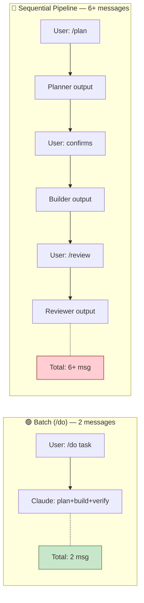
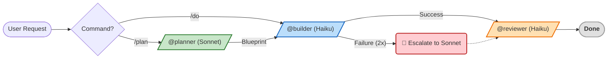

> **[한국어 버전](README.ko.md)**

<!-- Badges -->


# Claude Pro MinMax (CPMM)

> **Minimum Tokens, Maximum Intelligence. Beyond the Quota limits.**

A Claude Code configuration optimized for Pro Plan constraints.

---

> [!TIP]
> **🚀 3-Second Summary: Why use this?**
> 1.  **Model Cost Control:** Uses **Haiku (1/5 cost)** for implementation, **Sonnet** for design — not expensive Opus.
> 2.  **Output Tax Awareness:** Agent response budgets + CLI filtering cut output tokens (which cost **5x** input).
> 3.  **Zero-Cost Automation:** **11 local hooks** that enforce safety without using the API.

---

## 🛠 Installation

### 1. Prerequisites
```bash
npm install -g @anthropic-ai/claude-code
npm install -g @mixedbread/mgrep
mgrep install-claude-code
brew install jq   # macOS (Linux: sudo apt-get install jq)
```

### 2. One-Line Install
```bash
/bin/bash -c "$(curl -fsSL https://raw.githubusercontent.com/move-hoon/claude-pro-minmax/main/install.sh)"
```

### 3. Post-Install Configuration (Optional)
**The installation script will ask for your Perplexity API Key and output language.**
If you skipped language selection, you can configure it manually:
- **Non-English:** Create `~/.claude/rules/language.md` with your preferred language
- **English (default):** No file needed. Remove `~/.claude/rules/language.md` if it exists

If you skipped Perplexity setup during installation, you can set it up manually:
1. Open `~/.claude.json`.
2. Add the following to the `mcpServers` object:
   ```json
   "perplexity": {
     "command": "npx",
     "args": ["-y", "@perplexity-ai/mcp-server"],
     "env": {
       "PERPLEXITY_API_KEY": "YOUR_API_KEY_HERE"
     }
   }
   ```

> **Other included MCP servers (Enabled by default):**
> - **Sequential Thinking**: Powerful reasoning tool for complex logic.
> - **Context7**: Advanced documentation fetching and context management.

> **Note:** The installation script automatically backs up your existing `~/.claude` settings (`~/.claude-backup-{timestamp}`).

### 4. Project Initialization
> **Tip:** Before running `claude`, set up `.claude/CLAUDE.md` and `.claude/settings.json` by referencing the templates in `~/.claude/project-templates/`. This ensures optimizations are active from the start.

---

## Problem Definition

Claude Pro Plan has constraints that fundamentally change how you should use Claude Code:

- **5-Hour Rolling Reset**: Usage resets every 5 hours, encouraging short and focused sessions.
- **Message-Based Quota (Length-Sensitive)**: As the conversation gets longer (as context accumulates), the quota deducted per message increases exponentially. ([Claude Help Center](https://support.anthropic.com/en/articles/8325606-what-is-claude-pro))
- **Weekly Limits**: Additional weekly caps are applied to heavy users.

The original [everything-claude-code](https://github.com/affaan-m/everything-claude-code) is a powerful tool optimized for the near-unlimited **Max Plan** environment. However, using it unmodified on the **Pro Plan** wastes quota — expensive models (Opus) for simple tasks, verbose agent outputs, and unnecessary message round-trips all burn through your 5-hour budget.

This project maintains powerful features while redesigning the architecture to fit Pro Plan constraints.

---

## Core Strategy

### 1. Goal
**Maximize session sustainability within Pro Plan's 5-hour Quota window.**

This configuration is designed to extend productive work time by reducing Quota consumption per task. The goal is not "limit bypass," but **resource efficiency optimization** to work longer without exhausting the allocation.

### 2. Approach
While Anthropic hasn't disclosed the exact algorithm, Quota consumption is affected by the following factors. This project optimizes all of them through one principle: **Maximum Value Per Message.**

* **Model Cost (Primary — 5x):** Haiku costs 1/5 of Opus (API pricing). Use the cheapest model that can do the job.
* **Output Tokens (High Impact — 5x):** Output costs 5x Input (API pricing). Strict response budgets on every agent.
* **Message Count (Direct):** Fewer messages = less quota. Batch operations (plan+build+verify) in a single `/do` call.
* **CLI Filtering:** `jq`, `mgrep` reduce tool output tokens, shrinking both input and output.

### 3. Execution Strategy: Value-First Workflow

1.  **Default: Batch Execution (`/do`)**
    * Simple tasks (1-3 files): `/do` handles plan+build+verify in one shot.
    * No planner overhead. No human confirmation between phases.
    * **Result: 2 messages** (user request + Claude response) vs 6+ with sequential pipeline.

2.  **Optional: Sequential Pipeline (`/plan`)**
    * Medium-to-complex tasks (4+ files): `/plan` → `@builder` → `@reviewer`.
    * Use when you need human checkpoints between phases.
    * Use when the planning step itself requires validation before building.

3.  **Cost Minimization per Task**
    * `@builder` (Haiku): Handles implementation (1/5 cost of Opus).
    * `@planner` (Sonnet): Architecture design (balanced capability and cost).
    * **Opus**: Escalation only — explicit `/do-opus` makes cost visible.

4.  **Safe Escalation Path (Safety Ladder)**
    * Haiku failure (after 2 retries) → Escalate to Sonnet (`/do-sonnet`).
    * Sonnet failure → Escalate to Opus (`/do-opus`).
    * Makes cost apparent through explicit model selection.

---

## 📊 Results and Comparison

**What this configuration enables:**
✅ Significantly longer sessions through model cost optimization (Haiku = 1/5 Opus).
✅ Fewer messages per task through batch execution (`/do`).
✅ Reduced output tokens through strict agent response budgets.

> [!NOTE]
> **Note:** Anthropic's exact Quota algorithm is private. This configuration optimizes based on API pricing and verified cost factors; actual results may vary depending on task complexity.

### Cost Comparison: Batch vs Sequential

> The real savings come from **sending fewer, cheaper messages**, not from execution order.



| Factor | Measured Impact | Mechanism |
|--------|----------------|-----------|
| **Model Selection** | **5x cost reduction** | Haiku ($1/MTok) vs Opus ($5/MTok) — API pricing |
| **Output Budget** | **~60% output reduction** | Agent response limits (builder: 5 lines, reviewer: 1 line PASS) |
| **Batch Execution** | **~3x fewer messages** | `/do` = 2 msg vs sequential pipeline = 6+ msg |
| **CLI Filtering** | **~50% tool output reduction** | `jq`, `mgrep` reduces input tokens from tool results |

---


## 🚀 Quick Start

### 🤖 Agent Workflow

CPMM automatically moves between Sonnet (Design) and Haiku (Implementation) based on task complexity to achieve optimal efficiency.



### ⌨️ Command Guide

**1. Core Commands**

Essential commands used most frequently.

| Command | Description | Recommended Situation |
| --- | --- | --- |
| `/do [task]` | Rapid implementation with **Haiku** | Simple bug fixes, script writing |
| `/plan [task]` | **Sonnet** Design → **Haiku** Implementation | Feature additions, refactoring, complex logic |
| `/review [target]` | **Haiku** (Read-only) | Code review (Specify file or directory) |

<details>
<summary><strong>🚀 Advanced Commands - Click to Expand</strong></summary>

Full command list for more sophisticated tasks or session management.

| Command | Description | Recommended Situation |
| :--- | :--- | :--- |
| **🧠 Deep Execution** | | |
| `/dplan [task]` | **Sonnet** + Perplexity, Sequential Thinking, Context7 | Library comparison, latest tech research (Deep Research) |
| `/do-sonnet` | Execute directly with **Sonnet** | Manual escalation when Haiku keeps failing |
| `/do-opus` | Execute directly with **Opus** | Resolving extremely complex problems (Cost caution) |
| **💾 Session/Context** | | |
| `/session-save` | Summarize and save session | When pausing work (Auto-removal of secrets) |
| `/session-load` | Load session | Resuming previous work |
| `/compact-phase` | Step-by-step context compaction | When context cleanup is needed mid-session |
| `/load-context` | Load context templates | Initial setup for frontend/backend |
| **🛠️ Utility** | | |
| `/learn` | Learn and save patterns | Registering frequently recurring errors or preferred styles |
| `/analyze-failures`| Analyze error logs | Identifying causes of recurring errors |
| `/watch` | Process monitoring (tmux) | Observing long-running builds/tests |
| `/llms-txt` | Fetch documentation | Loading official library docs in LLM format |

</details>

---

## 📚 Documentation Hub

This project provides detailed documentation for each component. Refer to the links below for specific operating principles and customization methods.

| Category | Description | Detailed Docs (Click) |
| :--- | :--- | :--- |
| **🤖 Agents** | Definitions of roles and prompts for Planner, Builder, Reviewer, etc. | [📂 **Agents Guide**](.claude/agents/README.md) |
| **🕹️ Commands** | Usage of 14 commands including /plan, /do, /review | [📂 **Commands Guide**](.claude/commands/README.md) |
| **🪝 Hooks** | Logic of 11 automation scripts including Pre-check, Auto-format | [📂 **Hooks Guide**](scripts/hooks/README.md) |
| **📏 Rules** | Policies for Security, Code Style, Critical Actions | [📂 **Rules Guide**](.claude/rules/README.md) |
| **🧠 Skills** | Technical specifications for tools like CLI Wrappers | [📂 **Skills Guide**](.claude/skills/README.md) |
| **🔧 Contexts** | Context templates for Backend/Frontend projects | [📂 **Contexts Guide**](.claude/contexts/README.md) |
| **💾 Sessions** | Structure for session summary storage and management | [📂 **Sessions Guide**](.claude/sessions/README.md) |
| **🛠️ Scripts** | Collection of general-purpose scripts for Verify, Build, Test | [📂 **Scripts Guide**](scripts/README.md) |
| **⚙️ Runtime** | Automatic project language/framework detection system | [📂 **Runtime Guide**](scripts/runtime/README.md) |
| **🔌 Adapters** | Details on build adapters by language (Java, Node, Go, etc.) | [📂 **Adapters Guide**](scripts/runtime/adapters/README.md) |
| **🎓 Learned** | Pattern data accumulated through the /learn command | [📂 **Learned Skills**](.claude/skills/learned/README.md) |

---

## 📂 Project Structure

<details>
<summary><strong>📁 View File Tree (Click to Expand)</strong></summary>

```text
claude-pro-minmax
├── .claude.json                # Global MCP Settings (User Scope)
├── install.sh                  # One-click installation script
├── LICENSE                     # MIT License
├── README.md                   # English Documentation
├── README.ko.md                # Korean Documentation
├── .claude/
│   ├── CLAUDE.md               # Core Instructions (Loaded in all sessions)
│   ├── settings.json           # Project Settings (Permissions, hooks, env vars)
│   ├── settings.local.json     # Local user settings (Excluded from Git)
│   ├── agents/                 # Agent Definitions
│   │   ├── planner.md          # Sonnet: Architecture and design decisions
│   │   ├── dplanner.md         # Sonnet+MCP: Deep planning utilizing external tools
│   │   ├── builder.md          # Haiku: Code implementation and refactoring
│   │   └── reviewer.md         # Haiku: Read-only code review
│   ├── commands/               # Slash Commands
│   │   ├── plan.md             # Architecture planning (Sonnet -> Haiku)
│   │   ├── dplan.md            # Deep research planning (Sequential Thinking)
│   │   ├── do.md               # Direct execution (Default: Haiku)
│   │   ├── do-sonnet.md        # Execute with Sonnet model
│   │   ├── do-opus.md          # Execute with Opus model
│   │   ├── review.md           # Code review command (Read-only)
│   │   ├── watch.md            # File/process monitoring via tmux
│   │   ├── session-save.md     # Save current session state
│   │   ├── session-load.md     # Restore previous session state
│   │   ├── compact-phase.md    # Guide for step-by-step context compaction
│   │   ├── load-context.md     # Load pre-defined context templates
│   │   ├── learn.md            # Save new patterns to memory
│   │   ├── analyze-failures.md # Analyze tool failure logs
│   │   └── llms-txt.md         # View LLM-optimized documentation
│   ├── rules/                  # Behavioral Rules
│   │   ├── critical-actions.md # Block dangerous commands (rm -rf, git push -f, etc.)
│   │   ├── code-style.md       # Coding conventions and standards
│   │   └── security.md         # Security best practices
│   ├── skills/                 # Tool Capabilities
│   │   ├── cli-wrappers/       # Lightweight CLI wrappers (Replaces MCP overhead)
│   │   └── learned/            # Patterns accumulated through /learn command
│   ├── contexts/               # Context Templates
│   │   ├── backend-context.md  # Backend-specific instructions
│   │   └── frontend-context.md # Frontend-specific instructions
│   ├── logs/                   # Log Directory
│   │   └── tool-failures.log   # Tool failure records
│   └── sessions/               # Saved session summaries (Markdown)
├── scripts/                    # Utilities and Automation
│   ├── verify.sh               # General-purpose verification script
│   ├── build.sh                # General-purpose build script
│   ├── test.sh                 # General-purpose test script
│   ├── lint.sh                 # General-purpose lint script
│   ├── commit.sh               # Standardized git commit helper
│   ├── create-branch.sh        # Branch creation helper
│   ├── analyze-failures.sh     # Log analysis tool for /analyze-failures
│   ├── scrub-secrets.js        # Logic to remove secrets when saving sessions
│   ├── hooks/                  # Zero-Cost Hooks (Automated checks)
│   │   ├── critical-action-check.sh # Pre-block dangerous commands
│   │   ├── tool-failure-log.sh      # Record failure log files
│   │   ├── pre-compact.sh           # Compaction pre-processor
│   │   ├── compact-suggest.sh       # Propose compaction when threshold is reached
│   │   ├── post-edit-format.sh      # Automatic formatting after editing
│   │   ├── readonly-check.sh        # Enforce read-only for reviewer
│   │   ├── retry-check.sh           # Enforce 2-retry limit for builder
│   │   ├── session-start.sh         # Session initialization logic
│   │   ├── session-cleanup.sh       # Cleanup and secret removal on exit
│   │   ├── stop-collect-context.sh  # Collect context on interruption
│   │   └── notification.sh          # Desktop notifications
│   └── runtime/                # Runtime Auto-detection
│       ├── detect.sh           # Project type detection logic
│       └── adapters/           # Build adapters by language
│           ├── _interface.sh   # Adapter interface definition
│           ├── _template.sh    # Template for new adapters
│           ├── generic.sh      # Generic fallback adapter
│           ├── go.sh           # Go/Golang adapter
│           ├── jvm.sh          # Java/Kotlin/JVM adapter
│           ├── node.sh         # Node.js/JavaScript/TypeScript adapter
│           ├── python.sh       # Python adapter
│           └── rust.sh         # Rust adapter
└── project-templates/          # Language and Framework Templates
    ├── backend/                # Backend project template
    └── frontend/               # Frontend project template
```

</details>

## Supported Runtimes

| Runtime | Build Tool | Detection Files |
|--------|----------|----------|
| JVM | Gradle, Maven | `build.gradle.kts`, `pom.xml` |
| Node | npm, pnpm, yarn, bun | `package.json` |
| Rust | Cargo | `Cargo.toml` |
| Go | Go Modules | `go.mod` |
| Python | pip, poetry, uv | `pyproject.toml`, `requirements.txt` |

To add a new runtime, copy and implement `scripts/runtime/adapters/_template.sh`.

---

## FAQ

<details>
<summary><strong>Q: How does this configuration optimize the Pro Plan quota?</strong></summary>

A: Anthropic's exact quota algorithm is not public. Optimization is based on three pillars:
- **Model Cost** (verified): Haiku is 1/5 the price of Opus per API pricing.
- **Output Reduction** (verified): Output tokens cost 5x input. Agent response budgets + CLI filtering reduce output.
- **Message Efficiency**: `/do` batches plan+build+verify into a single response (2 messages vs 6+ in sequential pipeline).

For tasks where you need human checkpoints, use `/plan` for sequential execution with review between phases.
</details>

<details>
<summary><strong>Q: Can I use Claude for the full 5 hours?</strong></summary>

A: **It is not guaranteed**. Session length depends on:
- Task complexity (simple fixes vs. large-scale refactoring).
- Model usage (mainly Haiku vs. mainly Opus).
- Context size (small files vs. entire codebase).

This configuration is designed to maximize session length within Pro Plan constraints, but it cannot bypass quota limits.
</details>

<details>
<summary><strong>Q: Can it be used on the Max Plan?</strong></summary>

A: Yes, but these optimizations may not be necessary. The Max Plan provides much higher usage limits, making Pro Plan constraints less relevant. For Max Plan users:
- Opus can be used as the default model without quota concerns.
- Git Worktrees and parallel sessions are practical.
- Output budgets and batch execution are still good practices, but not critical.

This configuration is specifically designed for the Pro Plan's 5-hour rolling reset and message-based quota system.
</details>

<details>
<summary><strong>Q: Does it conflict with existing Claude Code settings?</strong></summary>

A: It overwrites the `~/.claude/` directory. Please back up your existing settings before installation.
</details>

<details>
<summary><strong>Q: Which OS is supported?</strong></summary>

A: macOS and Linux are supported. Windows is available through WSL.
</details>

<details>
<summary><strong>Q: Why not use Opus for all tasks?</strong></summary>

A: API pricing (reflecting compute cost), Opus is much more expensive than Sonnet or Haiku. While the exact Pro Plan quota impact is not public, using Opus for all tasks would deplete the quota much faster. Explicit model selection (`/do-opus`) is used to ensure awareness when using expensive models.
</details>

---

## Credits

- **[affaan-m/everything-claude-code](https://github.com/affaan-m/everything-claude-code)** — Anthropic hackathon winner. The foundation of this project.
- [Claude Code Official Documentation](https://code.claude.com/docs/en/)

## Contributing

This is an open-source project. Contributions are welcome!

1. Fork the repository
2. Create a feature branch (`git checkout -b feature/amazing-feature`)
3. Commit changes (`git commit -m 'feat: Add amazing feature'`)
4. Push to the branch (`git push origin feature/amazing-feature`)
5. Create a Pull Request

## License

MIT License