> **[한국어 버전](README.ko.md)**

<!-- Badges -->


# Claude Pro MinMax (CPMM)

> **Minimum Tokens, Maximum Intelligence. Beyond the Quota limits.**

A Claude Code configuration optimized for Pro Plan constraints.

---

> [!TIP]
> **🚀 3-Second Summary: Why use this?**
> 1.  **Batch + Cheap Model:** `/do` sends ONE message to **Haiku (1/5 Opus cost)** — plan+build+verify in a single response.
> 2.  **Output Tax Awareness:** Agent response budgets + CLI filtering cut output tokens (which cost **5x** input).
> 3.  **Zero-Cost Safety:** **11 local hooks** + **atomic rollback** — all enforcement happens locally, zero API cost.

---

## 🛠 Installation

### 1. Prerequisites
```bash
npm install -g @anthropic-ai/claude-code
npm install -g @mixedbread/mgrep
mgrep install-claude-code
brew install jq   # macOS (Linux: sudo apt-get install jq)
```

### 2. One-Line Install
```bash
/bin/bash -c "$(curl -fsSL https://raw.githubusercontent.com/move-hoon/claude-pro-minmax/main/install.sh)"
```

### 3. Post-Install Configuration (Optional)
**The installation script will ask for your Perplexity API Key and output language.**
If you skipped language selection, you can configure it manually:
- **Non-English:** Create `~/.claude/rules/language.md` with your preferred language
- **English (default):** No file needed. Remove `~/.claude/rules/language.md` if it exists

If you skipped Perplexity setup during installation, you can set it up manually:
1. Open `~/.claude.json`.
2. Add the following to the `mcpServers` object:
   ```json
   "perplexity": {
     "command": "npx",
     "args": ["-y", "@perplexity-ai/mcp-server"],
     "env": {
       "PERPLEXITY_API_KEY": "YOUR_API_KEY_HERE"
     }
   }
   ```

> **Other included MCP servers (Enabled by default):**
> - **Sequential Thinking**: Powerful reasoning tool for complex logic.
> - **Context7**: Advanced documentation fetching and context management.

> **Note:** The installation script automatically backs up your existing `~/.claude` settings (`~/.claude-backup-{timestamp}`).

### 4. Project Initialization
> **Tip:** Before running `claude`, set up `.claude/CLAUDE.md` and `.claude/settings.json` by referencing the templates in `~/.claude/project-templates/`. This ensures optimizations are active from the start.

---

## 🚀 Quick Start

### 🤖 Agent Workflow

CPMM automatically moves between Sonnet (Design) and Haiku (Implementation) based on task complexity to achieve optimal efficiency.

```mermaid
flowchart LR
    Start([User Request]) --> Cmd{Command?}

    Cmd -->|/plan| Plan[/"@planner (Sonnet)"/]
    Cmd -->|/do| Snap["📸 git stash push"]

    Snap --> Build[/"@builder (Haiku)"/]
    Plan -->|Blueprint| Build
    Build -- "Success" --> Drop["🗑️ git stash drop"]
    Drop --> Review[/"@reviewer (Haiku)"/]
    Build -- "Failure (2x)" --> Pop["⏪ git stash pop"]
    Pop --> Escalate("🚨 Escalate to Sonnet")

    Review --> Done([Done])
    Escalate -.-> Review

    classDef planner fill:#c8e6c9,stroke:#2e7d32,stroke-width:2px;
    classDef builder fill:#bbdefb,stroke:#1565c0,stroke-width:2px;
    classDef reviewer fill:#ffe0b2,stroke:#ef6c00,stroke-width:2px;
    classDef escalate fill:#ffcdd2,stroke:#b71c1c,stroke-width:2px;
    classDef done fill:#e0e0e0,stroke:#9e9e9e,stroke-width:2px,font-weight:bold;
    classDef snapshot fill:#e8eaf6,stroke:#3f51b5,stroke-width:2px;

    class Plan planner;
    class Build builder;
    class Review reviewer;
    class Escalate escalate;
    class Done done;
    class Snap,Drop,Pop snapshot;
```



### ⌨️ Command Guide

**1. Core Commands**

Essential commands used most frequently.

| Command | Description | Recommended Situation |
| --- | --- | --- |
| `/do [task]` | Rapid implementation with **Haiku** | Simple bug fixes, script writing |
| `/plan [task]` | **Sonnet** Design → **Haiku** Implementation | Feature additions, refactoring, complex logic |
| `/review [target]` | **Haiku** (Read-only) | Code review (Specify file or directory) |

<details>
<summary><strong>🚀 Advanced Commands - Click to Expand</strong></summary>

Full command list for more sophisticated tasks or session management.

| Command | Description | Recommended Situation |
| :--- | :--- | :--- |
| **🧠 Deep Execution** | | |
| `/dplan [task]` | **Sonnet** + Perplexity, Sequential Thinking, Context7 | Library comparison, latest tech research (Deep Research) |
| `/do-sonnet` | Execute directly with **Sonnet** | Manual escalation when Haiku keeps failing |
| `/do-opus` | Execute directly with **Opus** | Resolving extremely complex problems (Cost caution) |
| **💾 Session/Context** | | |
| `/session-save` | Summarize and save session | When pausing work (Auto-removal of secrets) |
| `/session-load` | Load session | Resuming previous work |
| `/compact-phase` | Step-by-step context compaction | When context cleanup is needed mid-session |
| `/load-context` | Load context templates | Initial setup for frontend/backend |
| **🛠️ Utility** | | |
| `/learn` | Learn and save patterns | Registering frequently recurring errors or preferred styles |
| `/analyze-failures`| Analyze error logs | Identifying causes of recurring errors |
| `/watch` | Process monitoring (tmux) | Observing long-running builds/tests |
| `/llms-txt` | Fetch documentation | Loading official library docs in LLM format |

</details>

---

## Core Strategy

Claude Pro Plan has constraints that fundamentally change how you should use Claude Code:

- **5-Hour Rolling Reset**: Usage resets every 5 hours, encouraging short and focused sessions.
- **Message-Based Quota (Length-Sensitive)**: As the conversation gets longer (as context accumulates), the quota deducted per message increases exponentially. ([Claude Help Center](https://support.anthropic.com/en/articles/8325606-what-is-claude-pro))
- **Weekly Limits**: Additional weekly caps are applied to heavy users.

Without optimization, default Claude Code usage on the Pro Plan burns through quota fast — expensive models for simple tasks, verbose outputs, and unnecessary message round-trips all drain your 5-hour budget.

CPMM solves each of these:

| Pro Plan Challenge | CPMM Solution |
|---|---|
| Opus burns quota on simple tasks | **Haiku default** (1/5 the cost) — escalate only when needed |
| Output costs 5x input tokens | **Agent response budgets** (builder: 5 lines, reviewer: 1 line PASS) |
| Multi-step pipelines waste messages | **Batch `/do`** — plan+build+verify in ONE message (2 msg vs 6+) |
| Context grows → each message costs more | **3-tier compact warnings** (25/50/75) + auto-compact at 75% |
| Failed execution leaves dirty state | **Atomic rollback** (`git stash` snapshot → clean restore on failure) |
| Hooks/scripts consume API calls | **11 local hooks** — all enforcement runs locally at zero API cost |

### 1. Goal
**Maximize session sustainability within Pro Plan's 5-hour Quota window.**

This configuration is designed to extend productive work time by reducing Quota consumption per task. The goal is not "limit bypass," but **resource efficiency optimization** to work longer without exhausting the allocation.

### 2. Approach
While Anthropic hasn't disclosed the exact algorithm, Quota consumption is affected by the following factors. This project optimizes all of them through one principle: **Maximum Value Per Message.**

* **Model Cost (Primary — 5x):** Haiku costs 1/5 of Opus (API pricing). Use the cheapest model that can do the job.
* **Output Tokens (High Impact — 5x):** Output costs 5x Input (API pricing). Strict response budgets on every agent.
* **Message Count (Direct):** Fewer messages = less quota. Batch operations (plan+build+verify) in a single `/do` call.
* **CLI Filtering:** `jq`, `mgrep` reduce tool output tokens, shrinking both input and output.

### 3. Execution Strategy: Value-First Workflow

1.  **Default: Batch Execution (`/do`)**
    * Simple tasks (1-3 files): `/do` handles plan+build+verify in one shot.
    * No planner overhead. No human confirmation between phases.
    * **Result: 2 messages** (user request + Claude response) vs 6+ with sequential pipeline.

2.  **Optional: Sequential Pipeline (`/plan`)**
    * Medium-to-complex tasks (4+ files): `/plan` → `@builder` → `@reviewer`.
    * Use when you need human checkpoints between phases.
    * Use when the planning step itself requires validation before building.

3.  **Cost Minimization per Task**
    * `@builder` (Haiku): Handles implementation (1/5 cost of Opus).
    * `@planner` (Sonnet): Architecture design (balanced capability and cost).
    * **Opus**: Escalation only — explicit `/do-opus` makes cost visible.

4.  **Safe Escalation Path (Safety Ladder)**
    * Haiku failure (after 2 retries) → Escalate to Sonnet (`/do-sonnet`).
    * Sonnet failure → Escalate to Opus (`/do-opus`).
    * Makes cost apparent through explicit model selection.

5.  **Atomic Rollback (Failure Recovery)**
    * `/do`, `/do-sonnet`, `/do-opus` create a `git stash` snapshot before execution.
    * On success: snapshot is dropped (zero overhead).
    * On failure (after 2 retries): `git stash pop` restores pre-execution state.
    * **Benefit**: Clean state for immediate escalation — no manual cleanup, saving **2-4 messages per failure**.

---

## 📊 Results and Comparison

**What this configuration enables:**
✅ Significantly longer sessions through model cost optimization (Haiku = 1/5 Opus).
✅ Fewer messages per task through batch execution (`/do`).
✅ Reduced output tokens through strict agent response budgets.

> [!NOTE]
> **Note:** Anthropic's exact Quota algorithm is private. This configuration optimizes based on API pricing and verified cost factors; actual results may vary depending on task complexity.

### Cost Comparison: Batch vs Sequential

> The real savings come from **sending fewer, cheaper messages**, not from execution order.

```mermaid
flowchart LR
    subgraph "🟢 Batch (/do) — 2 messages"
        U1[User: /do task] --> C1[Claude: plan+build+verify]
        C1 -.- R1[Total: 2 msg]
    end

    subgraph "🔴 Sequential Pipeline — 6+ messages"
        U2[User: /plan] --> P[Planner output]
        P --> U3[User: confirms]
        U3 --> B[Builder output]
        B --> U4[User: /review]
        U4 --> RV[Reviewer output]
        RV -.- R2[Total: 6+ msg]
    end

    style R1 fill:#c8e6c9,stroke:#2e7d32
    style R2 fill:#ffcdd2,stroke:#b71c1c
```



| Factor | Measured Impact | Mechanism |
|--------|----------------|-----------|
| **Model Selection** | **5x cost reduction** | Haiku ($1/MTok) vs Opus ($5/MTok) — API pricing |
| **Output Budget** | **~60% output reduction** | Agent response limits (builder: 5 lines, reviewer: 1 line PASS) |
| **Batch Execution** | **~3x fewer messages** | `/do` = 2 msg vs sequential pipeline = 6+ msg |
| **CLI Filtering** | **~50% tool output reduction** | `jq`, `mgrep` reduces input tokens from tool results |
| **Atomic Rollback** | **2-4 msg saved per failure** | `git stash` snapshot before `/do` — clean state on failure, zero API cost |

---

<details>
<summary><strong>🔬 Architecture Analysis — Mathematical Basis for Design Decisions</strong></summary>

### Core Philosophy Validation

CPMM's "Maximum Value Per Message" directly minimizes the Pro Plan quota cost function:

```
Total_Quota ≈ Σ f(model_weight_i, context_size_i, output_size_i)
```

| Variable | CPMM Mechanism | Reduction |
|----------|---------------|-----------|
| `model_weight` | Haiku (0.33x) instead of Opus (1.67x) | **5x** (API pricing) |
| `output_size` | Agent response budgets (builder: 5 lines, reviewer: 1 line) | **~60%** (estimated) |
| `context_size` | CLI filtering (`jq`, `mgrep`) + auto-compact at 75% | **~50%** tool output (estimated) |

**Known limitation**: Context grows within a session as messages accumulate, making each successive message more expensive. Mitigated by 3-tier compact warnings (25/50/75 tool calls) and auto-compact at 75% context.

### Hybrid Strategy: Why Batch Default + Sequential Fallback

Let **p** = probability that a `/do` (batch) execution fails and requires escalation to `/plan` (sequential).

| Strategy | Formula | Messages per 100 Tasks |
|----------|---------|----------------------|
| Always `/plan` (sequential) | 6 × 100 | **600** |
| Hybrid (`/do` default) | 2×(1−p)×100 + (4+6)×p×100 | **200 + 800p** |

**Break-even**: 200 + 800p = 600 → **p = 0.50 (50%)**

| Failure Rate (p) | Hybrid Cost | Sequential Cost | Savings |
|:-:|:-:|:-:|:-:|
| 10% | 280 msg | 600 msg | **53%** |
| 20% | 360 msg | 600 msg | **40%** |
| 30% | 440 msg | 600 msg | **27%** |
| 40% | 520 msg | 600 msg | **13%** |
| 50% | 600 msg | 600 msg | 0% (break-even) |

**Conclusion**: Hybrid outperforms always-sequential for any realistic failure rate below 50%.

### Atomic Rollback Cost-Benefit

| Scenario | Without Rollback | With Rollback | Saved |
|----------|:-:|:-:|:-:|
| `/do` success | 2 msg | 2 msg | 0 |
| `/do` failure (2 retries) | 4 msg + 2-4 msg cleanup | 4 msg (auto-restore) | **2-4 msg** |
| API cost of rollback | — | 0 (`git stash` is local) | **0** |

### Optimization Factor Summary

| Factor | Impact | Evidence | Status |
|--------|--------|----------|:------:|
| Model Selection | **5x** cost reduction | API pricing: Haiku $1 vs Opus $5 /MTok | Verified |
| Output Tax | **5x** cost multiplier | API pricing: Output = 5× Input | Verified |
| Batch Execution | **~3x** fewer messages | `/do` = 2 msg vs `/plan` = 6+ msg | Measured |
| CLI Filtering | **~50%** tool output reduction | `jq`, `mgrep` field selection | Estimated |
| Atomic Rollback | **2-4 msg** saved per failure | `git stash` prevents dirty state | Estimated |

> **Overall Efficiency: 5-8x** (driven by model selection 5x, amplified by output reduction and message batching. Rollback prevents waste but does not change the multiplier.)

</details>

---

## 📚 Documentation Hub

This project provides detailed documentation for each component. Refer to the links below for specific operating principles and customization methods.

| Category | Description | Detailed Docs (Click) |
| :--- | :--- | :--- |
| **🤖 Agents** | Definitions of roles and prompts for Planner, Builder, Reviewer, etc. | [📂 **Agents Guide**](.claude/agents/README.md) |
| **🕹️ Commands** | Usage of 14 commands including /plan, /do, /review | [📂 **Commands Guide**](.claude/commands/README.md) |
| **🪝 Hooks** | Logic of 11 automation scripts including Pre-check, Auto-format | [📂 **Hooks Guide**](scripts/hooks/README.md) |
| **📏 Rules** | Policies for Security, Code Style, Critical Actions | [📂 **Rules Guide**](.claude/rules/README.md) |
| **🧠 Skills** | Technical specifications for tools like CLI Wrappers | [📂 **Skills Guide**](.claude/skills/README.md) |
| **🔧 Contexts** | Context templates for Backend/Frontend projects | [📂 **Contexts Guide**](.claude/contexts/README.md) |
| **💾 Sessions** | Structure for session summary storage and management | [📂 **Sessions Guide**](.claude/sessions/README.md) |
| **🛠️ Scripts** | Collection of general-purpose scripts for Verify, Build, Test | [📂 **Scripts Guide**](scripts/README.md) |
| **⚙️ Runtime** | Automatic project language/framework detection system | [📂 **Runtime Guide**](scripts/runtime/README.md) |
| **🔌 Adapters** | Details on build adapters by language (Java, Node, Go, etc.) | [📂 **Adapters Guide**](scripts/runtime/adapters/README.md) |
| **🎓 Learned** | Pattern data accumulated through the /learn command | [📂 **Learned Skills**](.claude/skills/learned/README.md) |

---

## 📂 Project Structure

<details>
<summary><strong>📁 View File Tree (Click to Expand)</strong></summary>

```text
claude-pro-minmax
├── .claude.json                # Global MCP Settings (User Scope)
├── install.sh                  # One-click installation script
├── LICENSE                     # MIT License
├── README.md                   # English Documentation
├── README.ko.md                # Korean Documentation
├── .claude/
│   ├── CLAUDE.md               # Core Instructions (Loaded in all sessions)
│   ├── settings.json           # Project Settings (Permissions, hooks, env vars)
│   ├── settings.local.json     # Local user settings (Excluded from Git)
│   ├── agents/                 # Agent Definitions
│   │   ├── planner.md          # Sonnet: Architecture and design decisions
│   │   ├── dplanner.md         # Sonnet+MCP: Deep planning utilizing external tools
│   │   ├── builder.md          # Haiku: Code implementation and refactoring
│   │   └── reviewer.md         # Haiku: Read-only code review
│   ├── commands/               # Slash Commands
│   │   ├── plan.md             # Architecture planning (Sonnet -> Haiku)
│   │   ├── dplan.md            # Deep research planning (Sequential Thinking)
│   │   ├── do.md               # Direct execution (Default: Haiku)
│   │   ├── do-sonnet.md        # Execute with Sonnet model
│   │   ├── do-opus.md          # Execute with Opus model
│   │   ├── review.md           # Code review command (Read-only)
│   │   ├── watch.md            # File/process monitoring via tmux
│   │   ├── session-save.md     # Save current session state
│   │   ├── session-load.md     # Restore previous session state
│   │   ├── compact-phase.md    # Guide for step-by-step context compaction
│   │   ├── load-context.md     # Load pre-defined context templates
│   │   ├── learn.md            # Save new patterns to memory
│   │   ├── analyze-failures.md # Analyze tool failure logs
│   │   └── llms-txt.md         # View LLM-optimized documentation
│   ├── rules/                  # Behavioral Rules
│   │   ├── critical-actions.md # Block dangerous commands (rm -rf, git push -f, etc.)
│   │   ├── code-style.md       # Coding conventions and standards
│   │   └── security.md         # Security best practices
│   ├── skills/                 # Tool Capabilities
│   │   ├── cli-wrappers/       # Lightweight CLI wrappers (Replaces MCP overhead)
│   │   └── learned/            # Patterns accumulated through /learn command
│   ├── contexts/               # Context Templates
│   │   ├── backend-context.md  # Backend-specific instructions
│   │   └── frontend-context.md # Frontend-specific instructions
│   ├── logs/                   # Log Directory
│   │   └── tool-failures.log   # Tool failure records
│   └── sessions/               # Saved session summaries (Markdown)
├── scripts/                    # Utilities and Automation
│   ├── verify.sh               # General-purpose verification script
│   ├── build.sh                # General-purpose build script
│   ├── test.sh                 # General-purpose test script
│   ├── lint.sh                 # General-purpose lint script
│   ├── commit.sh               # Standardized git commit helper
│   ├── create-branch.sh        # Branch creation helper
│   ├── snapshot.sh             # Atomic rollback for /do commands (git stash)
│   ├── analyze-failures.sh     # Log analysis tool for /analyze-failures
│   ├── scrub-secrets.js        # Logic to remove secrets when saving sessions
│   ├── hooks/                  # Zero-Cost Hooks (Automated checks)
│   │   ├── critical-action-check.sh # Pre-block dangerous commands
│   │   ├── tool-failure-log.sh      # Record failure log files
│   │   ├── pre-compact.sh           # Compaction pre-processor
│   │   ├── compact-suggest.sh       # 3-tier compact warnings (25/50/75)
│   │   ├── post-edit-format.sh      # Automatic formatting after editing
│   │   ├── readonly-check.sh        # Enforce read-only for reviewer
│   │   ├── retry-check.sh           # Enforce 2-retry limit for builder
│   │   ├── session-start.sh         # Session initialization logic
│   │   ├── session-cleanup.sh       # Cleanup and secret removal on exit
│   │   ├── stop-collect-context.sh  # Collect context on interruption
│   │   └── notification.sh          # Desktop notifications
│   └── runtime/                # Runtime Auto-detection
│       ├── detect.sh           # Project type detection logic
│       └── adapters/           # Build adapters by language
│           ├── _interface.sh   # Adapter interface definition
│           ├── _template.sh    # Template for new adapters
│           ├── generic.sh      # Generic fallback adapter
│           ├── go.sh           # Go/Golang adapter
│           ├── jvm.sh          # Java/Kotlin/JVM adapter
│           ├── node.sh         # Node.js/JavaScript/TypeScript adapter
│           ├── python.sh       # Python adapter
│           └── rust.sh         # Rust adapter
└── project-templates/          # Language and Framework Templates
    ├── backend/                # Backend project template
    └── frontend/               # Frontend project template
```

</details>

## Supported Runtimes

| Runtime | Build Tool | Detection Files |
|--------|----------|----------|
| JVM | Gradle, Maven | `build.gradle.kts`, `pom.xml` |
| Node | npm, pnpm, yarn, bun | `package.json` |
| Rust | Cargo | `Cargo.toml` |
| Go | Go Modules | `go.mod` |
| Python | pip, poetry, uv | `pyproject.toml`, `requirements.txt` |

To add a new runtime, copy and implement `scripts/runtime/adapters/_template.sh`.

---

## FAQ

<details>
<summary><strong>Q: How does this configuration optimize the Pro Plan quota?</strong></summary>

A: Anthropic's exact quota algorithm is not public. Optimization is based on three pillars:
- **Model Cost** (verified): Haiku is 1/5 the price of Opus per API pricing.
- **Output Reduction** (verified): Output tokens cost 5x input. Agent response budgets + CLI filtering reduce output.
- **Message Efficiency**: `/do` batches plan+build+verify into a single response (2 messages vs 6+ in sequential pipeline).

For tasks where you need human checkpoints, use `/plan` for sequential execution with review between phases.
</details>

<details>
<summary><strong>Q: Can I use Claude for the full 5 hours?</strong></summary>

A: **It is not guaranteed**. Session length depends on:
- Task complexity (simple fixes vs. large-scale refactoring).
- Model usage (mainly Haiku vs. mainly Opus).
- Context size (small files vs. entire codebase).

This configuration is designed to maximize session length within Pro Plan constraints, but it cannot bypass quota limits.
</details>

<details>
<summary><strong>Q: Can it be used on the Max Plan?</strong></summary>

A: Yes, but these optimizations may not be necessary. The Max Plan provides much higher usage limits, making Pro Plan constraints less relevant. For Max Plan users:
- Opus can be used as the default model without quota concerns.
- Git Worktrees and parallel sessions are practical.
- Output budgets and batch execution are still good practices, but not critical.

This configuration is specifically designed for the Pro Plan's 5-hour rolling reset and message-based quota system.
</details>

<details>
<summary><strong>Q: Does it conflict with existing Claude Code settings?</strong></summary>

A: It overwrites the `~/.claude/` directory. Please back up your existing settings before installation.
</details>

<details>
<summary><strong>Q: Which OS is supported?</strong></summary>

A: macOS and Linux are supported. Windows is available through WSL.
</details>

<details>
<summary><strong>Q: Why not use Opus for all tasks?</strong></summary>

A: API pricing (reflecting compute cost), Opus is much more expensive than Sonnet or Haiku. While the exact Pro Plan quota impact is not public, using Opus for all tasks would deplete the quota much faster. Explicit model selection (`/do-opus`) is used to ensure awareness when using expensive models.
</details>

<details>
<summary><strong>Q: What happens when /do fails mid-execution?</strong></summary>

A: CPMM uses **Atomic Rollback**. Before `/do` executes, `git stash push` saves a snapshot. If execution fails after 2 retries, `git stash pop` restores the working tree to its pre-execution state. This prevents dirty state and saves 2-4 messages that would otherwise be spent on manual cleanup.

- Cost: Zero (git stash is a local operation)
- Limitation: Only tracks existing (tracked) files. Newly created files require manual removal.
</details>

---

## Credits

- **[affaan-m/everything-claude-code](https://github.com/affaan-m/everything-claude-code)** — Anthropic hackathon winner. The foundation of this project.
- [Claude Code Official Documentation](https://code.claude.com/docs/en/)

## Contributing

This is an open-source project. Contributions are welcome!

1. Fork the repository
2. Create a feature branch (`git checkout -b feature/amazing-feature`)
3. Commit changes (`git commit -m 'feat: Add amazing feature'`)
4. Push to the branch (`git push origin feature/amazing-feature`)
5. Create a Pull Request

## License

MIT License
