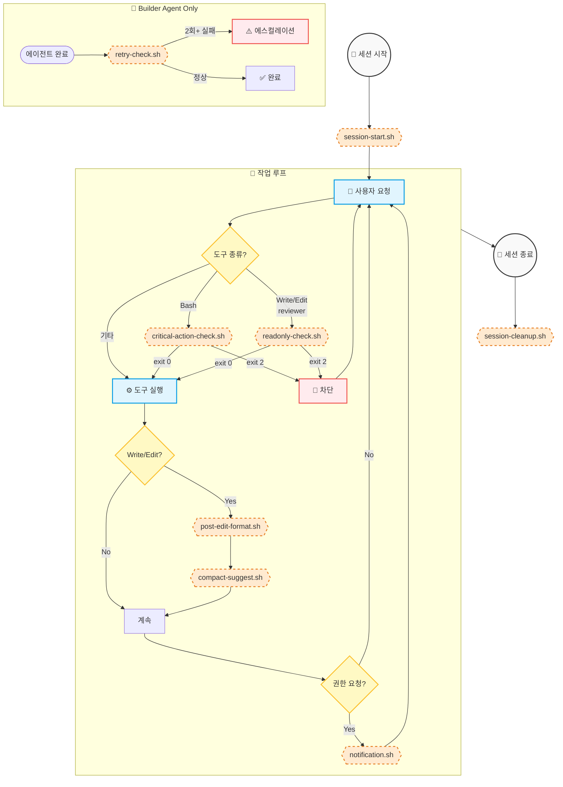

> **[English Version](README.md)**

# Hooks Directory

## 목적
Claude Code의 공식 Hooks 시스템에서 실행되는 로컬 자동화 스크립트입니다. Hook 실행 자체는 quota를 소비하지 않으며, Claude에게 보여지는 출력 메시지만 최소한의 입력 토큰을 소비합니다.

## Hook 생명주기



## Hook 스크립트

| 스크립트 | 이벤트 | 목적 | 실행 비용 |
|--------|-------|---------|------------|
| `critical-action-check.sh` | PreToolUse | 위험한 Bash 명령 차단 | 로컬 (무료), 차단 시 메시지 |
| `post-edit-format.sh` | PostToolUse | 편집된 파일 자동 포맷 | 로컬 (무료) |
| `compact-suggest.sh` | PostToolUse | 50번 도구 호출 시 /compact 제안 | 로컬 (무료), 제안 메시지는 최소 |
| `notification.sh` | Notification | 권한/입력 대기 시 데스크톱 알림 | 로컬 (무료) |
| `session-start.sh` | SessionStart | 환경변수 설정 + 예산 알림 + 세션 알림 | 로컬 (무료), 예산 컨텍스트 ~40 입력 토큰 |
| `session-cleanup.sh` | SessionEnd | 비밀 정보 제거 + 세션 요약 저장 | 로컬 (무료) |
| `retry-check.sh` | Stop | 연속 2회 실패 시 차단 (builder만) | 로컬 (무료), 에스컬레이션 메시지 |
| `stop-collect-context.sh` | Stop | 실패 컨텍스트 수집 (선택 사항) | 로컬 (무료) |
| `readonly-check.sh` | PreToolUse | 읽기 전용 적용 (reviewer) | 로컬 (무료), 차단 시 메시지 |
| `pre-compact.sh` | PreCompact | 압축 전 상태 저장 | 로컬 (무료) |
| `tool-failure-log.sh` | PostToolUseFailure | 도구 실패 로깅 | 로컬 (무료) |

**비용 설명:** 모든 Hook은 머신에서 로컬로 실행되어 API 호출이 없습니다. Hook이 Claude에게 메시지를 표시할 때만(예: 명령 차단, 컴팩션 제안) 해당 메시지가 입력 토큰을 소비하며, 이러한 메시지는 의도적으로 간결합니다.

## 종료 코드

| 코드 | 동작 |
|------|----------|
| 0 | 정상 계속 |
| 1 | 오류 (기록됨, 계속) |
| 2 | 도구 실행 **차단** 및 피드백 |

## 입출력

Hooks는 stdin을 통해 JSON을 받습니다. 스키마는 이벤트 유형에 따라 다릅니다.

**예시 (PreToolUse/Bash):**
```json
{
  "tool_name": "Bash",
  "tool_input": { "command": "git push --force" }
}
```

**예시 (Stop):**
```json
{
  "stop_hook_active": true,
  "transcript_path": "/path/to/transcript"
}
```

차단(exit 2) 시 **stderr**로의 출력이 Claude에게 표시됩니다. 참고: exit 2에서는 stdout JSON이 처리되지 않습니다.

> **참고:** 정확한 스키마는 공식 Claude Code 문서를 참조하세요: https://code.claude.com/docs/ko/hooks

## 새 Hook 추가

1. 이 디렉토리에 스크립트 생성
2. 실행 가능하게 만들기: `chmod +x script.sh`
3. `settings.json` 또는 에이전트 frontmatter에 추가
4. 다양한 입력으로 테스트
