> **[한국어 버전](README.ko.md)**

# Hooks Directory

## Purpose
Local automation scripts executed by Claude Code's official Hooks system. Hook execution itself consumes zero quota—only their output messages (when shown to Claude) consume minimal input tokens.

## Hook Lifecycle

```mermaid
flowchart TB
    %% Style definitions %%
    classDef startend fill:#f9f9f9,stroke:#333,stroke-width:2px;
    classDef script fill:#ffead0,stroke:#e67e22,stroke-width:2px,stroke-dasharray: 5 5;
    classDef process fill:#e1f5fe,stroke:#039be5,stroke-width:2px;
    classDef decision fill:#fff9c4,stroke:#fbc02d,stroke-width:2px;
    classDef error fill:#ffebee,stroke:#ef5350,stroke-width:2px;

    Start((🚀 Session Start)):::startend --> SS{{session-start.sh}}:::script
    SS --> Request

    subgraph WorkLoop["🔄 Work Loop"]
        Request[📝 User Request]:::process --> ToolType{Tool Type?}:::decision
        
        %% PreToolUse branches %%
        ToolType -->|Bash| CAC{{critical-action-check.sh}}:::script
        ToolType -->|Write/Edit<br/>reviewer| ROC{{readonly-check.sh}}:::script
        ToolType -->|Other| Tool
        
        CAC -->|exit 0| Tool[⚙️ Tool Execution]:::process
        CAC -->|exit 2| Block[🚫 Blocked]:::error
        ROC -->|exit 0| Tool
        ROC -->|exit 2| Block
        
        Block --> Request
        
        %% PostToolUse %%
        Tool --> IsWrite{Write/Edit?}:::decision
        IsWrite -->|Yes| PEF{{post-edit-format.sh}}:::script
        IsWrite -->|No| Continue
        PEF --> CS{{compact-suggest.sh}}:::script
        CS --> Continue
        
        %% Notification %%
        Continue[Continue] --> Perm{Permission?}:::decision
        Perm -->|Yes| NF{{notification.sh}}:::script
        Perm -->|No| Request
        NF --> Request
    end

    WorkLoop --> End((🏁 Session End)):::startend
    End --> SC{{session-cleanup.sh}}:::script

    %% Builder only - separate flow %%
    subgraph BuilderOnly["🔧 Builder Agent Only"]
        AgentDone([Agent Complete]) --> RC{{retry-check.sh}}:::script
        RC -->|2+ failures| Escalate[⚠️ Escalate]:::error
        RC -->|OK| Done[✅ Done]
    end
```



## Hook Scripts

| Script | Event | Purpose | Execution Cost |
|--------|-------|---------|----------------|
| `critical-action-check.sh` | PreToolUse | Block dangerous Bash commands | Local (zero), blocking message if triggered |
| `post-edit-format.sh` | PostToolUse | Auto-format edited files | Local (zero) |
| `compact-suggest.sh` | PostToolUse | Suggest /compact at 50 tool calls | Local (zero), suggestion message minimal |
| `notification.sh` | Notification | Desktop alert on permission/idle | Local (zero) |
| `session-start.sh` | SessionStart | Env setup + session notify (opt-in) | Local (zero), notification minimal |
| `session-cleanup.sh` | SessionEnd | Scrub secrets + save session summary | Local (zero) |
| `retry-check.sh` | Stop | Enforce 2-retry cap (builder only) | Local (zero), escalation message if triggered |
| `stop-collect-context.sh` | Stop | Collect failure contexts (optional) | Local (zero) |
| `readonly-check.sh` | PreToolUse | Enforce read-only (reviewer) | Local (zero), blocking message if triggered |
| `pre-compact.sh` | PreCompact | Save state before compaction | Local (zero) |
| `tool-failure-log.sh` | PostToolUseFailure | Log failures for debugging | Local (zero) |

**Cost Explanation:** All hooks run locally on your machine without API calls. Only when a hook displays a message to Claude (e.g., blocking a command, suggesting compaction) does that message consume input tokens—and these messages are intentionally brief.

## Exit Codes

| Code | Behavior |
|------|----------|
| 0 | Continue normally |
| 1 | Error (logged, continues) |
| 2 | **Block** tool execution with feedback |

## Input/Output

Hooks receive JSON via stdin. Schema varies by event type.

**Example (PreToolUse/Bash):**
```json
{
  "tool_name": "Bash",
  "tool_input": { "command": "git push --force" }
}
```

**Example (Stop):**
```json
{
  "stop_hook_active": true,
  "transcript_path": "/path/to/transcript"
}
```

Output to **stderr** is shown to Claude when blocking (exit 2). Note: stdout JSON is NOT processed for exit code 2.

> **Note:** For exact schemas, see official Claude Code documentation: https://code.claude.com/docs/hooks

## Adding New Hooks

1. Create script in this directory
2. Make executable: `chmod +x script.sh`
3. Add to `settings.json` or agent frontmatter
4. Test with various inputs

